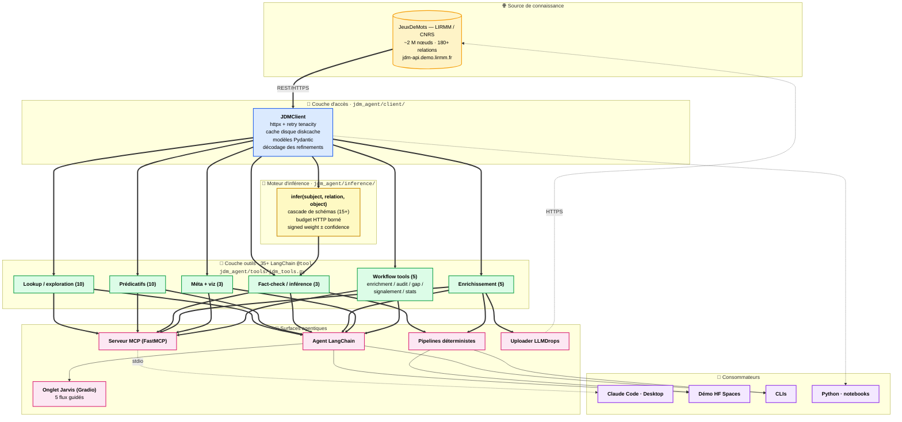

# JDMAgent

**Agentification d'un graphe lexico-sémantique du français pour les modèles de langue modernes — couplage hybride neuro-symbolique pour le fact-checking, l'enrichissement assisté et la désambiguïsation.**

---

## Résumé

JDMAgent fait pont entre **JeuxDeMots** (JDM), base de connaissances lexicale du
français issue de plus de quinze ans de jeu collaboratif au LIRMM/CNRS
[\[1, 2, 3\]](#references), et l'écosystème actuel des agents fondés sur les
grands modèles de langue (LLM). JDM expose environ deux millions de nœuds et
plus de cent-quatre-vingts relations sémantiques typées (hyperonymie, méronymie,
rôle télique, sujet de procès, etc.), navigables et signées en consensus
&mdash; une ressource structurelle absente des couches de connaissance que les
LLM modernes embarquent statistiquement. Le projet l'expose par une couche
d'outils Python conformes à *LangChain* et un serveur conforme au
*Model Context Protocol* (MCP) [\[4\]](#references), permettant son utilisation
en *tool use* [\[5, 6\]](#references) depuis n'importe quel agent. Trois
contributions méthodologiques : (i) graphe typé plutôt que RAG vectoriel
[\[7, 8\]](#references) pour les questions lexico-sémantiques ; (ii) séparation
stricte *extraction par LLM / vérification par Python* pour le fact-checking
anti-hallucination [\[9, 10, 11\]](#references) ; (iii) moteur d'inférence
symbolique borné en cascade de schémas, mobilisé à la fois pour la vérification
et pour la consolidation des candidats en phase d'enrichissement
[\[12, 13\]](#references).

---

## Essayer sans installation

| Canal | Pour qui | Lien |
|---|---|---|
| 🌐 **Démo web** (Hugging Face Spaces) | Découverte interactive — explorer le graphe, fact-checker, visualiser un sous-graphe, dialoguer avec l'agent ou les flux guidés Jarvis | [`expAg/jdmagent`](https://huggingface.co/spaces/expAg/jdmagent) |
| 🤖 **Serveur MCP local** | Utilisateurs de Claude Code/Desktop, Cursor, Continue | `claude mcp add jdm --scope user -- python -m jdm_agent.mcp.server` (cf. [USAGE.md](USAGE.md)) |
| 📓 **Notebook Google Colab** | Exploration pédagogique en Python | [](https://colab.research.google.com/github/expAg/JDMAgent/blob/main/notebooks/demo.ipynb) |

---

## 1. Enjeux et positionnement

### 1.1 Sous-représentation des ressources lexicales structurées du français

Les LLM contemporains intériorisent la connaissance lexicale via les
co-occurrences observées en pré-entraînement, sans représentation symbolique
explicite. Pour l'anglais, des ressources comme WordNet [\[14\]](#references)
ou ConceptNet [\[15\]](#references) servent de garde-fous symboliques aux
systèmes d'IA depuis trois décennies. Pour le français, l'équivalent
quantitatif et qualitatif est **JeuxDeMots** [\[1, 2\]](#references) — produit
d'un programme de GWAPs (*games with a purpose*, [\[16, 17\]](#references))
conduit depuis 2007 par M. Lafourcade et l'équipe TEXTE du LIRMM. Ce graphe
ne dispose toutefois pas d'une couche d'agentification standardisée à la
hauteur des protocoles d'aujourd'hui. JDMAgent comble cet écart : il rend
JDM consommable, dans une seule commande d'installation, par tout client
*MCP-compatible* (Claude Code/Desktop, Cursor, etc.) et par tout pipeline
LangChain.

### 1.2 Limites du RAG vectoriel pour la connaissance lexicale

Le *retrieval-augmented generation* [\[7\]](#references) approxime la
similarité sémantique par distance dans un espace d'embeddings. Cette
approche est puissante pour la recherche documentaire ouverte, mais elle
**ignore la structure relationnelle** des liens sémantiques : la requête
« quels sont les types de X ? » est mal résolue par une similarité globale.
Plusieurs travaux récents en *KG-augmented LLM* (knowledge-graph + LLM,
[\[8, 12\]](#references)) montrent l'intérêt complémentaire des graphes
typés. Pour les classes de questions structurées (taxonomie, méronymie,
rôle, propriété), naviguer un graphe avec relations typées est strictement
plus expressif qu'une similarité d'embeddings. JDM en offre un, déjà construit
et auto-annoté en signes de consensus.

### 1.3 Hallucination et fact-checking

L'hallucination factuelle des LLM est un obstacle reconnu à leur déploiement
en contexte critique [\[9\]](#references). Les systèmes de fact-checking dits
*LLM-as-judge* enchaînent souvent extraction et vérification dans le même
modèle, héritant des biais de génération [\[10, 11\]](#references). JDMAgent
sépare strictement les deux phases : l'extraction du triplet candidat est
faite par un LLM (tâche linguistique créative), la vérification est une
recherche déterministe dans le graphe JDM, complétée si nécessaire d'un
moteur d'inférence symbolique [\[12, 13\]](#references). Le verdict est
toujours accompagné de la chaîne de triplets qui le supporte ou le
contredit, satisfaisant les attentes de traçabilité énoncées dans
[\[18\]](#references).

### 1.4 Couplage neuro-symbolique pour la consolidation des contributions

Le projet JDM, comme toute ressource collaborative, a des **trous de
couverture**. La proposition spontanée par un LLM est une voie naturelle
pour les boucher, mais une proposition n'est utile que si elle est
**cohérente avec l'existant**. JDMAgent ferme la boucle entre *créativité
neuronale* (LLM qui propose) et *garantie logique* (graphe qui valide) en
soumettant chaque candidat à un moteur d'inférence symbolique borné : seul
un triplet *déductible* du réseau existant est marqué prêt pour soumission
au canal contributif de JDM. Cette discipline s'inscrit dans la lignée des
architectures neuro-symboliques contemporaines [\[19, 20\]](#references).

---

## 2. Architecture



### 2.1 Couche d'accès

Un client Python typé (Pydantic v2), wrapping l'API REST publique de JDM
(<https://jdm-api.demo.lirmm.fr>) avec retry exponentiel `tenacity`, cache
disque agressif `diskcache`, et décodage automatique des *refinements*
de sens (identifiants opaques `avocat>116477>66699` → forme lisible
`avocat (personne, juriste)`).

### 2.2 Moteur d'inférence symbolique borné

Implémenté dans [`inference/engine.py`](src/jdm_agent/inference/engine.py), il
répond à la question « le triplet *A R B* est-il **déductible** du graphe ? »
distincte de la question de **contenance** (« est-il *littéralement présent* ? »).
La distinction est cruciale et préservée dans toutes les sorties : un fait
seulement déductible porte toujours un `inference_schema` et est annoncé
comme tel. Le moteur enchaîne une cascade de schémas (transitivité,
déduction par généralisation, élimination par classe, contraste antonymique,
propagation par hyponymie, composition de relations curée, etc.), bornée par
un *budget dur* d'appels HTTP — l'inférence reste à coût garanti, conformément
aux principes énoncés dans [\[13\]](#references) pour les systèmes
neuro-symboliques en production.

### 2.3 Couche outils & protocoles d'agent

Les outils sont déclarés une seule fois (décorateur LangChain `@tool`) et
exposés à deux surfaces :

- **Agent LangChain** ([`tools/jdm_agent.py`](src/jdm_agent/tools/jdm_agent.py))
  via `create_agent`, avec un prompt système strict imposant la citation
  systématique des triplets sources.
- **Serveur MCP** ([`mcp/server.py`](src/jdm_agent/mcp/server.py)) via
  FastMCP, interopérable avec tout client compatible MCP
  [\[4\]](#references).

Les docstrings des outils sont *enrichies automatiquement* à partir de la
taxonomie [`relation_definitions.md`](relation_definitions.md) afin de
guider le routage du LLM ; ce mécanisme s'inscrit dans la lignée des
travaux sur l'enseignement implicite des LLMs à utiliser des outils
[\[5, 6\]](#references).

### 2.4 Onglet *Jarvis* — flux guidés par formulaires

Cinq sous-onglets dédiés à des tâches métier (Enrichissement, Audit
sémantique, Détection de trous, Signalement d'incohérences, Statistiques),
chacun produisant un fichier typé (`.enrich`, `.audit`, `.err`, `.stat`)
soumissible au canal contributif de JDM. Le pré-prompt envoyé au LLM est
construit côté Python à partir des champs du formulaire — l'utilisateur
n'écrit aucun prompt et n'a donc pas à connaître l'API conversationnelle de
l'agent. Approche dite *guided prompting* qui réduit la variance des sorties
et facilite l'évaluation.

---

## 3. Boucle d'enrichissement contributif (Phases 11–12)

C'est la **finalité visée** par le projet : un LLM tiers propose des triplets
pour boucher les trous de JDM, le système les valide par inférence dans le
graphe existant, et les soumissions consolidées sont POSTées au endpoint
contributif de JDM sans intervention humaine.

```
┌───────────────────────────────────────────────────────────────────────┐
│ 1. Pré-fetch (list_existing_for_enrichment)                           │
│    → liste exhaustive des triplets déjà présents pour (term, rel)     │
│    → exclusion_set normalisé prêt pour matching                       │
├───────────────────────────────────────────────────────────────────────┤
│ 2. Désambiguïsation (disambiguate, si polysémique)                    │
│    → le LLM choisit le sens visé, conserve le sense_id raffiné        │
├───────────────────────────────────────────────────────────────────────┤
│ 3. Proposition (LLM, hors exclusion_set)                              │
│    → la correction sémantique est la responsabilité du LLM            │
├───────────────────────────────────────────────────────────────────────┤
│ 4. Validation + consolidation (validate_candidate)                    │
│    → validation structurelle (unknown/duplicate/inconsistent/ok)      │
│    → consolidation par inférence (consolidated/rejected/silent)       │
│    → ready_for_submission = true ⟺ déductible du graphe existant      │
├───────────────────────────────────────────────────────────────────────┤
│ 5. Écriture + soumission (write_submission_file, upload=True)         │
│    → fichier local au format `terme | rel | cible | annot < expli >`  │
│    → upload optionnel vers http://jeuxdemots.org/LLMDrops.php         │
│    → nom standardisé HHhMM_DD-MM-YY_automatic_submission_from_X.<ext>│
└───────────────────────────────────────────────────────────────────────┘
```

La consolidation par inférence est ce qui distingue ce projet d'une simple
*proposition* à base de LLM : on ne soumet à JDM que des triplets que le
graphe existant *permet déjà de déduire*. Discipline équivalente à celle des
systèmes d'auto-correction par vérification externe étudiés dans
[\[10\]](#references).

---

## 4. Composants principaux

| Composant | Rôle | Fichier |
|---|---|---|
| **JDMClient** | Client typé Pydantic, retry httpx, cache disque, décodage refinements | [`src/jdm_agent/client/client.py`](src/jdm_agent/client/client.py) |
| **Modèles Pydantic** | `Node`, `Relation`, `RelationType`, `DecodedRefinement`, `Annotation` | [`src/jdm_agent/client/models.py`](src/jdm_agent/client/models.py) |
| **Cache disque** | Wrapper `diskcache` à TTL configurable par catégorie | [`src/jdm_agent/client/cache.py`](src/jdm_agent/client/cache.py) |
| **Parser de relations** | Parse `relation_definitions.md` pour enrichir les docstrings | [`src/jdm_agent/client/relations.py`](src/jdm_agent/client/relations.py) |
| **Moteur d'inférence** | `infer(...)` avec cascade de schémas symboliques bornée | [`src/jdm_agent/inference/`](src/jdm_agent/inference/) |
| **Outils LangChain** | Wrappers `@tool` ; cf. `ALL_TOOLS` dans `jdm_tools.py` | [`src/jdm_agent/tools/jdm_tools.py`](src/jdm_agent/tools/jdm_tools.py) |
| **Workflow tools** | `enrichment_workflow`, `audit_workflow`, `gap_detection_workflow`, `signalement_workflow`, `stats_workflow` | idem |
| **Agent LangChain** | `create_agent` + prompt système strict, helpers `ask()` / `stream()` | [`src/jdm_agent/tools/jdm_agent.py`](src/jdm_agent/tools/jdm_agent.py) |
| **ToolBudget** | Compteur d'appels d'outils par invocation (ContextVar), sentinel `BUDGET_EXHAUSTED` | [`src/jdm_agent/tools/budget.py`](src/jdm_agent/tools/budget.py) |
| **LLM factory** | `init_chat_model("provider:model")`, agnostique | [`src/jdm_agent/tools/llm_factory.py`](src/jdm_agent/tools/llm_factory.py) |
| **Serveur MCP** | FastMCP, réutilise les outils via `.func` | [`src/jdm_agent/mcp/server.py`](src/jdm_agent/mcp/server.py) |
| **Fact-checker** | `Claim`, `Verdict`, verifier déterministe + repli d'inférence | [`src/jdm_agent/factcheck/`](src/jdm_agent/factcheck/) |
| **Enrichissement** | `detect_gaps`, `propose_candidates`, `validate_candidate`, `consolidate_candidate` | [`src/jdm_agent/enrich/`](src/jdm_agent/enrich/) |
| **Uploader LLMDrops** | POST automatique d'une soumission consolidée à JDM, extension préservée (.enrich / .audit / .err / .stat) | [`src/jdm_agent/enrich/uploader.py`](src/jdm_agent/enrich/uploader.py) |
| **Visualisation** | Sous-graphe interactif vis-network (HTML autonome) | [`src/jdm_agent/viz/`](src/jdm_agent/viz/) |
| **Démo HF** | App Gradio à 6 onglets (Projet, Explorer, Claim checker, Sous-graphe, Agent, Jarvis, Aide) | [`app.py`](app.py) |
| **Builders Jarvis** | `build_*_prompt`, `run_jarvis_flow`, `submit_existing_file` | [`jarvis.py`](jarvis.py) |

---

## 5. Installation

```bash
git clone https://github.com/expAg/JDMAgent.git
cd JDMAgent
python -m venv .venv
.venv\Scripts\activate          # Windows  (ou source .venv/bin/activate)

# Installation de base + LangChain
pip install -e ".[dev,langchain]"

# Providers LLM (au choix)
pip install -e ".[anthropic]"   # Claude
pip install -e ".[openai]"      # GPT
pip install -e ".[google]"      # Gemini
pip install -e ".[ollama]"      # local

# Serveur MCP (recommandé)
pip install -e ".[mcp]"

# Configuration
cp .env.example .env
# édite .env : ANTHROPIC_API_KEY / OPENAI_API_KEY / LLM_PROVIDER / LLM_MODEL
# et pour la soumission contributive : JDM_DROPS_API_KEY
```

Tests :
```bash
pytest                  # 163/163 passants à l'heure actuelle
```

---

## 6. Démarrage rapide

```bash
# 1. Interactif : brancher le MCP dans Claude Code
claude mcp add jdm --scope user -- python -m jdm_agent.mcp.server

# 2. Batch fact-check déterministe (sans LLM)
jdm-factcheck --claim "baleine r_isa poisson"

# 3. Enrichissement + soumission automatique
jdm-enrich --terms chat --consolidate --upload --upload-model claude-opus-4-7

# 4. Python API
python -c "from jdm_agent.client import JDMClient; \
           print(JDMClient().synonyms('voiture', min_weight=50)[:3])"
```

Voir [USAGE.md](USAGE.md) pour les workflows complets et les options de
chaque CLI.

---

## 7. Roadmap par phases

| Phase | Livré | Contenu |
|---|---|---|
| 0–2 | ✅ | Bootstrap projet, client typé, couche outils LangChain |
| 3 | ✅ | Q&A CLI avec agent LangChain |
| 4 | ✅ | Serveur MCP FastMCP |
| 5 | ✅ | Fact-checker (pipeline `factcheck/`) |
| 6 | ✅ | Enrichissement actif (détection de gaps, proposition LLM, validation) |
| 7 | ⏳ | Spike DuckDB / NetworkX pour requêtes multi-saut |
| 8 | ✅ | Déploiement public — HF Spaces, Render, Colab |
| 9–10 | ✅ | Polarité, annotations, inverses verbo-nominaux |
| 11 | ✅ | Moteur d'inférence symbolique borné, consolidation des candidats |
| 12 | ✅ | Soumission automatique au LLMDrops JDM |
| 13 | ✅ | Onglet *Jarvis* — 5 flux guidés par formulaire (Enrich/Audit/Gap/Err/Stat) |

Détails et journal de bord dans [DEVELOPMENT.md](DEVELOPMENT.md).

---

## 8. Documentation

- **[USAGE.md](USAGE.md)** — guide d'utilisation complet. Trois canaux
  (Claude Code via MCP, CLI, Python API), workflows-types, lecture des
  sorties (terminal, JSON, CSV, fichiers de soumission).
- **[DEVELOPMENT.md](DEVELOPMENT.md)** — documentation technique. Roadmap
  détaillée, setup dev, tests, dépannage, considérations de performance,
  contributions.
- **[relation_definitions.md](relation_definitions.md)** — taxonomie
  complète des 180+ relations JDM avec descriptions, exemples, et notes
  sur l'orientation tête/queue. Utilisée pour enrichir automatiquement
  les docstrings des outils LangChain.

---

<a id="references"></a>
## Références

**JeuxDeMots et GWAPs**
1. Lafourcade, M. (2007). *Making people play for Lexical Acquisition with the JeuxDeMots prototype*. SNLP'07, 7th International Symposium on Natural Language Processing, Bangkok.
2. Lafourcade, M., & Joubert, A. (2008). *JeuxDeMots : un prototype ludique pour l'émergence de relations entre termes*. Actes de JADT 2008, Lyon.
3. Lafourcade, M., Joubert, A., & Le Brun, N. (2015). *Games with a Purpose (GWAPs)*. Wiley-ISTE.
16. von Ahn, L. (2006). *Games with a Purpose*. Computer, 39(6), 92–94. <https://doi.org/10.1109/MC.2006.196>
17. von Ahn, L., & Dabbish, L. (2008). *Designing games with a purpose*. Communications of the ACM, 51(8), 58–67.

**Bases lexicales structurées**
14. Miller, G. A. (1995). *WordNet: A Lexical Database for English*. Communications of the ACM, 38(11), 39–41.
15. Speer, R., Chin, J., & Havasi, C. (2017). *ConceptNet 5.5: An Open Multilingual Graph of General Knowledge*. AAAI 2017.

**Protocoles et tool use**
4. Anthropic. (2024). *Introducing the Model Context Protocol*. <https://www.anthropic.com/news/model-context-protocol>
5. Schick, T., Dwivedi-Yu, J., Dessì, R., Raileanu, R., Lomeli, M., Zettlemoyer, L., Cancedda, N., & Scialom, T. (2023). *Toolformer: Language Models Can Teach Themselves to Use Tools*. NeurIPS 2023.
6. Yao, S., Zhao, J., Yu, D., Du, N., Shafran, I., Narasimhan, K., & Cao, Y. (2023). *ReAct: Synergizing Reasoning and Acting in Language Models*. ICLR 2023.

**RAG, KG-LLM et architecture hybride**
7. Lewis, P., Perez, E., Piktus, A., Petroni, F., Karpukhin, V., Goyal, N., et al. (2020). *Retrieval-Augmented Generation for Knowledge-Intensive NLP Tasks*. NeurIPS 2020.
8. Pan, J. Z., Razniewski, S., Kalo, J.-C., Singhania, S., Chen, J., Dietze, S., et al. (2024). *Unifying Large Language Models and Knowledge Graphs: A Roadmap*. IEEE TKDE.
12. Edge, D., Trinh, H., Cheng, N., Bradley, J., Chao, A., Mody, A., Truitt, S., & Larson, J. (2024). *From Local to Global: A Graph RAG Approach to Query-Focused Summarization*. arXiv:2404.16130.

**Hallucination, fact-checking, auto-correction des LLM**
9. Ji, Z., Lee, N., Frieske, R., Yu, T., Su, D., Xu, Y., et al. (2023). *Survey of Hallucination in Natural Language Generation*. ACM Computing Surveys, 55(12).
10. Pan, L., Saxon, M., Xu, W., Nathani, D., Wang, X., & Wang, W. Y. (2024). *Automatically Correcting Large Language Models: Surveying the Landscape of Diverse Self-Correction Strategies*. TACL.
11. Min, S., Krishna, K., Lyu, X., Lewis, M., Yih, W., Koh, P. W., Iyyer, M., Zettlemoyer, L., & Hajishirzi, H. (2023). *FActScore: Fine-grained Atomic Evaluation of Factual Precision in Long Form Text Generation*. EMNLP 2023.
18. Bommasani, R., Hudson, D. A., Adeli, E., et al. (2021). *On the Opportunities and Risks of Foundation Models*. arXiv:2108.07258 (sections sur traçabilité et provenance).

**Neuro-symbolique**
13. Marra, G., Diligenti, M., Giannini, F., Maggini, M., & Melacci, S. (2024). *Neuro-symbolic learning, neural-symbolic systems, and their challenges*. Frontiers in Artificial Intelligence.
19. Garcez, A. d'A., & Lamb, L. C. (2023). *Neurosymbolic AI: the 3rd Wave*. Artificial Intelligence Review, 56, 12387–12406.
20. Hitzler, P., Eberhart, A., Ebrahimi, M., Sarker, M. K., & Zhou, L. (2022). *Neuro-symbolic approaches in artificial intelligence*. National Science Review, 9(6).

---

## Crédits

- **JeuxDeMots** : M. Lafourcade et l'équipe TEXTE, **LIRMM, CNRS /
  Université de Montpellier**. Plateforme lancée en 2007, alimentée par des
  centaines de milliers de contributeurs.
  - Site jeu : <https://www.jeuxdemots.org>
  - API publique : <https://jdm-api.demo.lirmm.fr>
  - Documentation des relations : <https://www.jeuxdemots.org/jdm-about-detail-relations.php>
- **LangChain** : <https://langchain.com>
- **Model Context Protocol** : <https://modelcontextprotocol.io>
- **FastMCP** : <https://github.com/jlowin/fastmcp>

## Licence

À définir.
