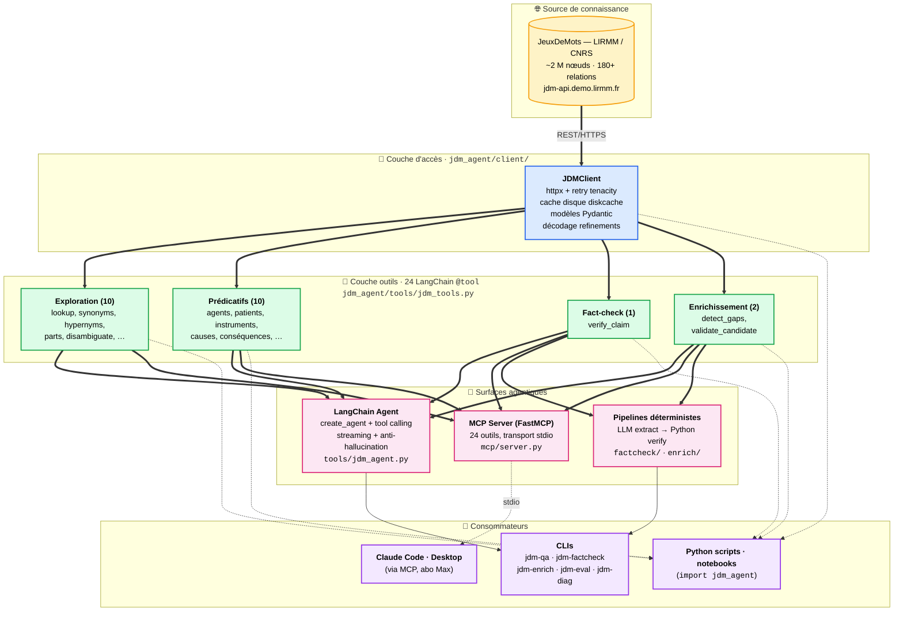

# JDMAgent — Agentification d'une base de connaissance lexico-sémantique

> **Projet de recherche** : transformer **JeuxDeMots** — graphe lexical du
> français (~2 M de nœuds, 180+ types de relations, construit en 18 ans de jeu
> collaboratif au LIRMM) — en une ressource directement exploitable par les
> LLM modernes, via le protocole standard **MCP** et le framework **LangChain**.

---

## Objectif

Construire un système hybride **symbolique-neural** où :

- Le **savoir factuel et vérifiable** vient du graphe JeuxDeMots — connaissance
  lexicale du français consensuelle, typée, navigable.
- Le **raisonnement, l'interaction, la créativité** viennent d'un LLM
  (Claude, GPT, modèle local Ollama).

Le projet cible trois usages prioritaires, déjà livrés :

1. **Q&A linguistique *grounded*** — un LLM qui répond sur le français sans
   inventer, parce que chaque affirmation est sourcée par un triplet JDM réel
   (`chat | r_isa | mammifère (w=1000)`).
2. **Anti-hallucination** — un *fact-checker* déterministe qui vérifie les
   sorties d'un autre LLM contre le graphe (verdict `supported` /
   `contradicted` / `unknown` avec triplets justificatifs).
3. **Enrichissement assisté** — détection automatique des lacunes de couverture
   JDM, proposition de triplets candidats par le LLM, validation déterministe,
   export CSV pour la modération JDM.

---

## Motivation scientifique : pourquoi un agent LLM + KG structuré ?

Trois positions méthodologiques structurent le projet.

### 1. Graphe de connaissance typé ≻ RAG vectoriel pour la connaissance lexicale

Le RAG vectoriel approxime la similarité sémantique mais **perd la structure
relationnelle**. JDM expose **explicitement** des relations typées
([180+ types documentés](relation_definitions.md) — `r_isa`, `r_has_part`,
`r_carac`, `r_agent`, `r_telic_role`, …), navigables transitivement.

Pour la classe de questions du type *« qu'est-ce qu'un X ? »*, *« Y est-il un
type de Z ? »*, *« à quoi sert un W ? »*, la structure typée est **strictement
plus expressive** qu'une similarité d'embeddings : on peut chaîner les
relations, détecter des incompatibilités (`r_isa-incompatible`), désambiguïser
la polysémie via des raffinements de sens.

### 2. Hybride neural-symbolique pour le fact-checking

Le module [`factcheck/`](src/jdm_agent/factcheck/) sépare proprement deux phases :

| Phase | Implémenté par | Pourquoi ce choix |
|---|---|---|
| **Extraction** (phrase NL → triplet) | LLM | Tâche fondamentalement linguistique, où la créativité du LLM est utile |
| **Vérification** (triplet → verdict) | Python pur + JDM | Tâche logique, exige déterminisme et traçabilité |

La vérification **ne fait jamais appel au LLM**. Elle est auditable
(chaque verdict cite ses triplets sources), reproductible, et résistante aux
biais du modèle. C'est l'inverse exact du pattern *LLM-as-judge* qui domine
aujourd'hui — et qui peut justement halluciner ses propres verdicts.

### 3. Tool calling + MCP : la pile standardisée des agents augmentés

Un **agent LLM** au sens moderne = LLM + outils + boucle de décision + prompt
système. Le LLM ne décide *jamais* de la sémantique des outils ; il choisit
**lequel appeler** en lisant leur description et leur schéma de paramètres.
C'est cette autonomie de routage qui distingue un agent d'un RAG fixe.

Le **Model Context Protocol (MCP)**, normalisé par Anthropic fin 2024, est
devenu en quelques mois l'équivalent "USB-C" des agents : n'importe quel
client compatible (Claude Code, Claude Desktop, Cursor, Continue, …) peut
brancher n'importe quel serveur d'outils. Notre serveur MCP
([`mcp/server.py`](src/jdm_agent/mcp/server.py)) expose les **24 outils JDM**
en une seule commande d'installation.

C'est cette couche qui transforme le projet d'une preuve de concept Python
en un **outil quotidien**, utilisable sans frais API supplémentaire pour qui
a un abo Claude.

---

## Architecture



### Lecture du schéma

Quatre couches **du bas (concret) vers le haut (interaction)** :

1. **Source** — l'API REST publique de JeuxDeMots. Aucune modification (la
   ressource n'est qu'en lecture pour le public ; nos enrichissements sortent
   en CSV pour la modération).
2. **Accès** — un client typé Python avec cache disque agressif. Les coûts
   HTTP sont quasi-nuls après le premier appel grâce à
   [`diskcache`](src/jdm_agent/client/cache.py).
3. **Outils** — 24 fonctions Python décorées `@tool` dans
   [`jdm_tools.py`](src/jdm_agent/tools/jdm_tools.py). Chacune expose son
   schéma à un LLM via LangChain. Les docstrings sont *enrichies
   automatiquement* à partir de [`relation_definitions.md`](relation_definitions.md)
   — c'est l'aide à la décision donnée au LLM pour choisir le bon outil.
4. **Agents** — trois portes d'entrée pour les LLM/clients :
   - Un **agent LangChain** (`tools/jdm_agent.py`) qui pilote un LLM
     externe avec un prompt système anti-hallucination strict.
   - Un **serveur MCP** (FastMCP) qui réutilise *les mêmes 24 outils* sans
     duplication, accessible à n'importe quel client compatible.
   - Des **pipelines spécialisés** (`factcheck/`, `enrich/`) qui combinent
     extraction LLM et vérification déterministe.
5. **Consommateurs** — utilisation finale : conversation dans Claude
   Code/Desktop, scripts batch via CLI, ou intégration programmatique.

### Cycle d'une question — exemple « que peut faire un chat ? »

```
1. L'utilisateur pose la question dans Claude Code
2. Le LLM lit la question + les 24 outils sérialisés en JSON Schema
3. Il route mentalement : « action que peut faire un sujet » → r_agent-1
   « source = nom commun, donc pas get_agents (qui exige un verbe) »
   « r_agent-1 n'a pas d'outil dédié → get_relations_of_type »
4. Il génère un tool_use structuré :
     get_relations_of_type(term="chat", relation_name="r_agent-1")
5. Notre couche outils interroge JDM, décode les refinements éventuels,
   renvoie une liste de triplets [{source, relation, target, w}, ...]
6. Le LLM compose une réponse NL en citant les triplets de plus haut poids
```

Cette boucle peut s'enchaîner sur 3–10 outils pour une question complexe
(`disambiguate` puis `get_synonyms` puis `verify_claim`, etc.). Le LLM gère
le routage *à chaque tour*, en fonction de ce que les outils précédents ont
remonté.

---

## Composants principaux & où ils sont définis

| Composant | Rôle | Fichier |
|---|---|---|
| **JDMClient** | Client typé Pydantic, retry httpx, cache disque, décodage refinements | [`src/jdm_agent/client/client.py`](src/jdm_agent/client/client.py) |
| **Modèles Pydantic** | `Node`, `Relation`, `RelationType`, `DecodedRefinement` | [`src/jdm_agent/client/models.py`](src/jdm_agent/client/models.py) |
| **Cache disque** | Wrapper `diskcache` à TTL configurable | [`src/jdm_agent/client/cache.py`](src/jdm_agent/client/cache.py) |
| **Parser de relations** | Parse `relation_definitions.md` pour enrichir les docstrings | [`src/jdm_agent/client/relations.py`](src/jdm_agent/client/relations.py) |
| **24 outils LangChain** | Wrappers `@tool` (10 exploration + 10 prédicatifs + 4 verify/enrich) | [`src/jdm_agent/tools/jdm_tools.py`](src/jdm_agent/tools/jdm_tools.py) |
| **Agent LangChain** | `create_agent` + prompt système strict, helper `stream()` | [`src/jdm_agent/tools/jdm_agent.py`](src/jdm_agent/tools/jdm_agent.py) |
| **LLM factory** | `init_chat_model("provider:model")` agnostique | [`src/jdm_agent/tools/llm_factory.py`](src/jdm_agent/tools/llm_factory.py) |
| **Serveur MCP** | FastMCP, réutilise les 24 outils via `.func` | [`src/jdm_agent/mcp/server.py`](src/jdm_agent/mcp/server.py) |
| **Fact-checker** | `Claim`, `Verdict`, verifier en cascade | [`src/jdm_agent/factcheck/`](src/jdm_agent/factcheck/) |
| **Enrichissement** | `detect_gaps`, `propose_candidates`, `validate_candidate` | [`src/jdm_agent/enrich/`](src/jdm_agent/enrich/) |
| **Taxonomie des relations** | 180+ relations JDM avec descriptions et exemples — utilisée par le parser pour injecter dans les docstrings | [`relation_definitions.md`](relation_definitions.md) |
| **CLIs** | 6 entry points (`qa`, `eval`, `mcp`, `diag`, `factcheck`, `enrich`) | [`src/jdm_agent/apps/`](src/jdm_agent/apps/) |

---

## Le serveur MCP — pont vers les apps LLM

Le **Model Context Protocol** est devenu en 2024–2025 le standard de facto
pour brancher des outils à n'importe quel agent LLM. Notre serveur MCP rend
JDM **immédiatement disponible** dans :

- **Claude Desktop** (UI graphique)
- **Claude Code** (CLI/IDE)
- **Cursor, Continue.dev**, tout client MCP

C'est la couche qui rend ce projet utilisable au quotidien, **sans frais API
supplémentaire** quand on l'utilise via un abonnement Claude Max — c'est
Claude lui-même qui consomme du token, le serveur MCP local ne fait que servir
des données structurées.

**Installation côté Claude Code** :
```bash
claude mcp add jdm --scope user -- python -m jdm_agent.mcp.server
```

**Installation côté Claude Desktop** (`%APPDATA%\Claude\claude_desktop_config.json`) :
```json
{
  "mcpServers": {
    "jdm": { "command": "python", "args": ["-m", "jdm_agent.mcp.server"] }
  }
}
```

Une fois branché, tu peux demander dans la conversation :

> *« Pour le sens juridique de "avocat", liste 5 synonymes et vérifie chacun
> contre JDM. »*

Et Claude enchaînera `disambiguate` → `get_synonyms` → `verify_claim` × 5,
en citant systématiquement les triplets sources.

---

## Installation

```bash
git clone https://github.com/enhagu01-png/JDMAgent.git
cd JDMAgent
python -m venv .venv
.venv\Scripts\activate          # Windows  (ou source .venv/bin/activate)

# Installation de base + LangChain
pip install -e ".[dev,langchain]"

# Ajouter les providers LLM dont tu as besoin
pip install -e ".[anthropic]"   # Claude
pip install -e ".[openai]"      # GPT
pip install -e ".[ollama]"      # local

# Pour utiliser le serveur MCP (recommandé)
pip install -e ".[mcp]"

# Config (optionnel pour les CLIs avec LLM)
cp .env.example .env
# édite .env pour ANTHROPIC_API_KEY / OPENAI_API_KEY / LLM_PROVIDER / LLM_MODEL
```

Tests :
```bash
pytest
# 44/44 passants
```

---

## Démarrage rapide

Trois lignes pour les trois canaux d'usage :

```bash
# 1. Interactif : brancher le MCP dans Claude Code (gratuit avec abo Max)
claude mcp add jdm --scope user -- python -m jdm_agent.mcp.server

# 2. Batch fact-check sans LLM (instantané, déterministe)
jdm-factcheck --claim "baleine r_isa poisson"

# 3. Python API
python -c "from jdm_agent.client import JDMClient; \
print(JDMClient().synonyms('voiture', min_weight=50)[:3])"
```

Voir [USAGE.md](USAGE.md) pour les workflows complets.

---

## Documentation

- **[USAGE.md](USAGE.md)** — guide d'utilisation complet. Trois canaux
  (Claude Code MCP / CLI / Python API), workflows-types, lecture des
  sorties (terminal, JSON, CSV).
- **[DEVELOPMENT.md](DEVELOPMENT.md)** — documentation technique. Roadmap
  détaillée, setup dev, tests, dépannage, considérations de performance,
  contributions.
- **[`relation_definitions.md`](relation_definitions.md)** — taxonomie
  complète des 180+ relations JDM, avec description et exemples pour
  chacune. Utilisée pour enrichir automatiquement les docstrings des
  outils LangChain.

---

## Statut

Phases 0–6 livrées (bootstrap, client, agent LangChain, Q&A CLI, serveur MCP,
fact-checker, enrichissement actif). Phase 7 (dump local de sous-graphe sur
DuckDB/NetworkX pour les requêtes multi-saut) à venir.

**44/44 tests** passants. **24 outils MCP**, **6 CLIs** (`jdm-qa`,
`jdm-eval`, `jdm-mcp`, `jdm-diag`, `jdm-factcheck`, `jdm-enrich`).

Voir [DEVELOPMENT.md](DEVELOPMENT.md) pour la roadmap détaillée.

---

## Crédits et références

### JeuxDeMots
Mathieu Lafourcade et l'équipe TEXTE, **LIRMM, CNRS / Univ. Montpellier**.
Plateforme lancée en 2007, alimentée par des centaines de milliers de
contributeurs via le jeu *Diko*, *TOTAKI*, *AskIt*, etc.

- Site jeu : <https://www.jeuxdemots.org>
- API publique : <https://jdm-api.demo.lirmm.fr>
- Doc des relations : <https://www.jeuxdemots.org/jdm-about-detail-relations.php>

### Frameworks et protocoles
- **LangChain** ([langchain.com](https://langchain.com)) — agentification,
  tool calling, structured output.
- **MCP (Model Context Protocol)** — protocole ouvert d'outils LLM,
  spécifié par Anthropic (<https://modelcontextprotocol.io>).
- **FastMCP** — implémentation Python de référence côté serveur.

### Cadre scientifique
Le projet s'inscrit dans la lignée des travaux sur :
- Les **agents LLM tool-augmentés** (e.g. Toolformer, ReAct, OpenAI function
  calling, Anthropic tool use).
- Le **knowledge-graph augmented generation** (KAG, par opposition au RAG
  vectoriel).
- Les **architectures neuro-symboliques** mêlant raisonnement déterministe
  et génération neuronale.

---

## Licence

À définir.
