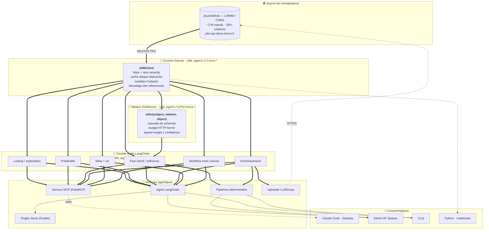

# JDMAgent

**Une couche d'agentification pour le graphe lexico-sémantique du français
JeuxDeMots : exposer une ressource symbolique construite par jeu
collaboratif à l'écosystème contemporain des agents fondés sur les
grands modèles de langue, et y adjoindre un cycle d'enrichissement
neuro-symbolique avec garde-fou d'inférence.**

---

## 1. Contexte et problématique

### 1.1 La fragilité épistémique des bases de connaissances lexicales

La construction et l'alimentation d'une base de connaissances lexicale
de grande taille demeurent, malgré quarante ans de travaux, une entreprise
*fragile* en théorie comme en pratique. Les difficultés y sont à la fois
d'ordre méthodologique, infrastructurel et épistémique. Elles incluent
notamment :

- **L'incomplétude irréductible.** Toute base lexicale, aussi vaste
  soit-elle, est lacunaire — non par défaut d'effort mais par nature
  combinatoire du lexique et de ses relations. WordNet
  (Fellbaum, 1998 ; Miller, 1995), DBpedia (Auer et al., 2007), YAGO
  (Suchanek et al., 2007), BabelNet (Navigli & Ponzetto, 2012),
  Wikidata (Vrandečić & Krötzsch, 2014) et ConceptNet (Speer et al., 2017)
  partagent tous, à des degrés divers, ce trait constitutif.

- **Le coût humain de l'annotation.** L'étiquetage de qualité demande des
  contributeurs experts ou semi-experts, ce qui freine l'extensibilité.
  Le crowdsourcing non expert peut s'y substituer en partie
  (Snow et al., 2008), mais introduit du bruit. Une réponse alternative
  consiste à *transformer la tâche d'annotation en jeu* — c'est l'approche
  des *Games With A Purpose* (von Ahn, 2006 ; von Ahn & Dabbish, 2008)
  dont JeuxDeMots est l'instance francophone canonique
  (Lafourcade, 2007 ; Lafourcade & Joubert, 2008 ;
  Lafourcade et al., 2015).

- **La polysémie et la dépendance contextuelle.** Le sens d'un terme
  n'est jamais pleinement déterminé hors de son contexte. Une relation
  vraie d'un sens (par exemple *avocat* = juriste → r_isa →
  personne) peut être fausse d'un autre sens (*avocat* = fruit) ;
  d'où la nécessité de structures de désambiguïsation et d'annotations
  contrastives (Navigli, 2009).

- **L'incohérence locale et la dérive sémantique.** Toute base
  alimentée incrémentalement produit, avec le temps, des poches
  d'incohérence : triplets contradictoires, relations sur-généralisées,
  raffinements de sens mal-classés. La détection automatique de ces
  défauts reste un problème ouvert
  (Paulheim, 2017 ; Heindorf et al., 2016).

- **L'évaluation et la reproductibilité.** Mesurer la qualité d'une base
  lexicale exige des protocoles dédiés ; les benchmarks restent
  fragmentés et la généralisation entre langues est limitée
  (Pilehvar & Camacho-Collados, 2019).

### 1.2 Les LLM contemporains comme ressource lexicale implicite

Les grands modèles de langue (Brown et al., 2020 ; Touvron et al., 2023)
encodent, en sous-produit de leur pré-entraînement, une connaissance
lexicale implicite, ce qui a été qualifié de *« language models as
knowledge bases »* (Petroni et al., 2019 ; AlKhamissi et al., 2022).
Cette connaissance implicite est cependant peu auditable, sujette à
l'hallucination factuelle (Ji et al., 2023), difficile à corriger sans
ré-entraînement, et structurellement biaisée vers l'anglais. Le couplage
explicite LLM ↔ base de connaissance reste donc une voie privilégiée
pour les applications où la traçabilité importe (Pan, Razniewski, et al., 2024).

### 1.3 Position du projet

JeuxDeMots (JDM) (Lafourcade, 2007) propose, à l'échelle du français, une
ressource structurée typée et auto-annotée en consensus, comparable en
densité et en couverture à WordNet pour l'anglais ou à ConceptNet
multilingue. Cette ressource reste cependant peu exploitée par les
systèmes contemporains d'agents LLM, faute d'une couche d'intégration
conforme aux protocoles désormais standards — *tool use*
(Schick et al., 2023 ; Yao et al., 2023) et *Model Context Protocol*
(Anthropic, 2024). JDMAgent comble cet écart selon trois orientations
méthodologiques :

1. **Préférer le graphe typé au RAG vectoriel pour la connaissance lexicale.**
   Le *retrieval-augmented generation* (Lewis et al., 2020) approxime la
   similarité sémantique par distance d'embeddings, au prix de la
   structure relationnelle. Pour des classes de questions structurées
   (taxonomie, méronymie, rôle télique, propriété), un graphe typé est
   strictement plus expressif. La présente couche d'outils, dont les
   docstrings sont enrichies depuis la taxonomie de JDM, permet au LLM
   de router vers la relation pertinente sans intermédiation vectorielle.

2. **Séparer extraction par LLM et vérification déterministe pour le
   fact-checking.** Le motif dit *LLM-as-judge* (Zheng et al., 2023)
   peut hériter des biais de génération
   (Pan, Saxon, et al., 2024 ; Min et al., 2023). On lui substitue ici une
   architecture en deux phases : extraction du triplet candidat par LLM
   (tâche linguistique), vérification par recherche déterministe et, le
   cas échéant, inférence symbolique bornée (tâche logique). Chaque
   verdict cite ses sources, conformément aux exigences de traçabilité
   discutées par Bommasani et al. (2021).

3. **Soumettre l'enrichissement contributif à un test d'inférence
   symbolique.** Plutôt que de simplement laisser un LLM produire des
   triplets candidats à soumettre, on les *valide* par cascade de schémas
   symboliques (transitivité, déduction par généralisation, élimination
   par classe, contraste antonymique, composition de relations) avant
   tout envoi au canal contributif de JDM. Seul un triplet *déductible*
   du réseau existant est soumis. Discipline cohérente avec les
   architectures neuro-symboliques contemporaines
   (Garcez & Lamb, 2023 ; Hitzler et al., 2022 ;
   Marra et al., 2024).

---

## 2. Mise en pratique

### 2.1 Essayer sans installation

| Canal | Pour qui | Lien |
|---|---|---|
| 🌐 Démo web (Hugging Face Spaces) | Découverte interactive : explorer le graphe, fact-checker, visualiser un sous-graphe, dialoguer avec l'agent, ou exécuter les flux guidés Jarvis | [`expAg/jdmagent`](https://huggingface.co/spaces/expAg/jdmagent) |
| 🤖 Serveur MCP local | Utilisateurs de Claude Code/Desktop, Cursor, Continue | `claude mcp add jdm --scope user -- python -m jdm_agent.mcp.server` (cf. [USAGE.md](USAGE.md)) |
| 📓 Notebook Google Colab | Exploration pédagogique en Python | [](https://colab.research.google.com/github/expAg/JDMAgent/blob/main/notebooks/demo.ipynb) |

### 2.2 Architecture



#### Lecture du schéma

- La **couche d'accès** isole l'API publique de JDM derrière un client
  Python typé. Cache disque agressif (`diskcache`), retry exponentiel
  (`tenacity`), modèles Pydantic v2.
- Le **moteur d'inférence** (`jdm_agent/inference/`) implémente la
  cascade de schémas symboliques évoquée plus haut et répond à la
  question « *A R B* est-il *déductible* du graphe ? », distincte de la
  question de contenance (« est-il *littéralement présent* ? »). La
  distinction est conservée dans toutes les sorties.
- La **couche d'outils LangChain** déclare une fois les ~35 fonctions
  utilisables. Elles sont consommées indifféremment par l'agent
  LangChain et par le serveur MCP, ce qui réduit la duplication.
- Les **pipelines déterministes** (fact-check et enrichissement)
  combinent extraction LLM et vérification symbolique. L'**uploader
  LLMDrops** poste automatiquement une soumission consolidée au canal
  contributif de JDM, en préservant l'extension du fichier
  (`.enrich` / `.audit` / `.err` / `.stat`).
- L'**onglet Jarvis** de la démo Gradio propose cinq flux guidés par
  formulaire (enrichissement, audit sémantique, détection de trous,
  signalement, statistiques). Le pré-prompt envoyé au LLM est construit
  côté Python à partir des champs du formulaire ; l'utilisateur n'écrit
  aucune instruction libre, ce qui réduit la variance des sorties.

### 2.3 Boucle d'enrichissement contributif

C'est la finalité visée par le projet : un LLM tiers propose des triplets
pour combler les trous de JDM, le système les valide par inférence dans
le graphe existant, et les soumissions consolidées sont POSTées au canal
contributif sans intervention humaine.

```
┌───────────────────────────────────────────────────────────────────────┐
│ 1. Pré-fetch (list_existing_for_enrichment)                           │
│    → liste exhaustive des triplets déjà présents pour (terme, rel)    │
│    → exclusion_set normalisé prêt pour matching                       │
├───────────────────────────────────────────────────────────────────────┤
│ 2. Désambiguïsation (disambiguate, si polysémique)                    │
│    → le LLM choisit le sens visé, conserve le sense_id raffiné        │
├───────────────────────────────────────────────────────────────────────┤
│ 3. Proposition (LLM, hors exclusion_set)                              │
├───────────────────────────────────────────────────────────────────────┤
│ 4. Validation + consolidation (validate_candidate)                    │
│    → validation structurelle (unknown/duplicate/inconsistent/ok)      │
│    → consolidation par inférence (consolidated/rejected/silent)       │
│    → ready_for_submission = true ⟺ déductible du graphe existant      │
├───────────────────────────────────────────────────────────────────────┤
│ 5. Écriture + soumission (write_submission_file, upload=True)         │
│    → fichier local au format `terme | rel | cible | annot < expli >`  │
│    → upload optionnel vers http://jeuxdemots.org/LLMDrops.php         │
└───────────────────────────────────────────────────────────────────────┘
```

La consolidation par inférence est ce qui distingue cette boucle d'une
simple proposition à base de LLM : on ne soumet à JDM que des triplets
que le graphe existant *permet déjà de déduire*. La discipline est
analogue à celle des systèmes d'auto-correction par vérification externe
recensés par Pan, Saxon, et al. (2024).

---

## 3. Composants

| Composant | Rôle | Fichier |
|---|---|---|
| `JDMClient` | Client typé Pydantic, retry httpx, cache disque, décodage refinements | [`src/jdm_agent/client/client.py`](src/jdm_agent/client/client.py) |
| Modèles Pydantic | `Node`, `Relation`, `RelationType`, `DecodedRefinement`, `Annotation` | [`src/jdm_agent/client/models.py`](src/jdm_agent/client/models.py) |
| Cache disque | Wrapper `diskcache` à TTL configurable | [`src/jdm_agent/client/cache.py`](src/jdm_agent/client/cache.py) |
| Parser de relations | Parse `relation_definitions.md` pour enrichir les docstrings | [`src/jdm_agent/client/relations.py`](src/jdm_agent/client/relations.py) |
| Moteur d'inférence | `infer(...)` avec cascade de schémas symboliques bornée | [`src/jdm_agent/inference/`](src/jdm_agent/inference/) |
| Outils LangChain | Wrappers `@tool` ; cf. `ALL_TOOLS` | [`src/jdm_agent/tools/jdm_tools.py`](src/jdm_agent/tools/jdm_tools.py) |
| Workflow tools | `enrichment_workflow`, `audit_workflow`, `gap_detection_workflow`, `signalement_workflow`, `stats_workflow` | idem |
| Agent LangChain | `create_agent` + prompt système strict, helpers `ask()` / `stream()` | [`src/jdm_agent/tools/jdm_agent.py`](src/jdm_agent/tools/jdm_agent.py) |
| `ToolBudget` | Compteur d'appels d'outils par invocation (ContextVar), sentinel `BUDGET_EXHAUSTED` | [`src/jdm_agent/tools/budget.py`](src/jdm_agent/tools/budget.py) |
| LLM factory | `init_chat_model("provider:model")`, agnostique | [`src/jdm_agent/tools/llm_factory.py`](src/jdm_agent/tools/llm_factory.py) |
| Serveur MCP | FastMCP, réutilise les outils via `.func` | [`src/jdm_agent/mcp/server.py`](src/jdm_agent/mcp/server.py) |
| Fact-checker | `Claim`, `Verdict`, verifier déterministe + repli d'inférence | [`src/jdm_agent/factcheck/`](src/jdm_agent/factcheck/) |
| Enrichissement | `detect_gaps`, `propose_candidates`, `validate_candidate`, `consolidate_candidate` | [`src/jdm_agent/enrich/`](src/jdm_agent/enrich/) |
| Uploader LLMDrops | POST automatique, extension préservée (`.enrich` / `.audit` / `.err` / `.stat`) | [`src/jdm_agent/enrich/uploader.py`](src/jdm_agent/enrich/uploader.py) |
| Visualisation | Sous-graphe interactif vis-network (HTML autonome) | [`src/jdm_agent/viz/`](src/jdm_agent/viz/) |
| Démo Gradio | App à 6 onglets (Projet, Explorer, Claim checker, Sous-graphe, Agent, Jarvis, Aide) | [`app.py`](app.py) |
| Builders Jarvis | `build_*_prompt`, `run_jarvis_flow`, `submit_existing_file` | [`jarvis.py`](jarvis.py) |

---

## 4. Installation

```bash
git clone https://github.com/expAg/JDMAgent.git
cd JDMAgent
python -m venv .venv
.venv\Scripts\activate          # Windows  (ou source .venv/bin/activate)

# Installation de base + LangChain
pip install -e ".[dev,langchain]"

# Providers LLM (au choix)
pip install -e ".[anthropic]"   # Claude
pip install -e ".[openai]"      # GPT
pip install -e ".[google]"      # Gemini
pip install -e ".[ollama]"      # local

# Serveur MCP (recommandé)
pip install -e ".[mcp]"

# Configuration
cp .env.example .env
# édite .env : ANTHROPIC_API_KEY / OPENAI_API_KEY / LLM_PROVIDER / LLM_MODEL
# et pour la soumission contributive : JDM_DROPS_API_KEY
```

Tests :
```bash
pytest                  # 163/163 passants à l'heure actuelle
```

---

## 5. Démarrage rapide

```bash
# 1. Interactif : brancher le MCP dans Claude Code
claude mcp add jdm --scope user -- python -m jdm_agent.mcp.server

# 2. Batch fact-check déterministe (sans LLM)
jdm-factcheck --claim "baleine r_isa poisson"

# 3. Enrichissement + soumission automatique
jdm-enrich --terms chat --consolidate --upload --upload-model claude-opus-4-7

# 4. Python API
python -c "from jdm_agent.client import JDMClient; \
           print(JDMClient().synonyms('voiture', min_weight=50)[:3])"
```

Voir [USAGE.md](USAGE.md) pour les workflows complets et les options de
chaque CLI.

---

## 6. Roadmap par phases

| Phase | Livré | Contenu |
|---|---|---|
| 0–2 | ✅ | Bootstrap projet, client typé, couche outils LangChain |
| 3 | ✅ | Q&A CLI avec agent LangChain |
| 4 | ✅ | Serveur MCP FastMCP |
| 5 | ✅ | Fact-checker (pipeline `factcheck/`) |
| 6 | ✅ | Enrichissement actif (détection de gaps, proposition LLM, validation) |
| 7 | ⏳ | Spike DuckDB / NetworkX pour requêtes multi-saut |
| 8 | ✅ | Déploiement public — HF Spaces, Render, Colab |
| 9–10 | ✅ | Polarité, annotations, inverses verbo-nominaux |
| 11 | ✅ | Moteur d'inférence symbolique borné, consolidation des candidats |
| 12 | ✅ | Soumission automatique au LLMDrops JDM |
| 13 | ✅ | Onglet *Jarvis* — 5 flux guidés par formulaire (Enrich/Audit/Gap/Err/Stat) |

Détails et journal de bord dans [DEVELOPMENT.md](DEVELOPMENT.md).

---

## 7. Documentation complémentaire

- [USAGE.md](USAGE.md) — guide d'utilisation (CLI, MCP, Python).
- [DEVELOPMENT.md](DEVELOPMENT.md) — documentation technique et roadmap.
- [relation_definitions.md](relation_definitions.md) — taxonomie complète
  des 180+ relations JDM avec descriptions, exemples et notes
  d'orientation.

---

## 8. Références

AlKhamissi, B., Li, M., Celikyilmaz, A., Diab, M., & Ghazvininejad, M.
(2022). *A Review on Language Models as Knowledge Bases*. arXiv:2204.06031.

Anthropic. (2024). *Introducing the Model Context Protocol*.
<https://www.anthropic.com/news/model-context-protocol>

Auer, S., Bizer, C., Kobilarov, G., Lehmann, J., Cyganiak, R., & Ives, Z.
(2007). DBpedia: A Nucleus for a Web of Open Data. In *Proceedings of
the 6th International Semantic Web Conference (ISWC 2007)*, LNCS 4825,
pp. 722–735. Springer.
<https://doi.org/10.1007/978-3-540-76298-0_52>

Bommasani, R., Hudson, D. A., Adeli, E., et al. (2021). *On the
Opportunities and Risks of Foundation Models*. arXiv:2108.07258.

Brown, T. B., Mann, B., Ryder, N., et al. (2020). Language Models are
Few-Shot Learners. *Advances in Neural Information Processing Systems
(NeurIPS 2020)*, 33, 1877–1901.

Fellbaum, C. (Ed.). (1998). *WordNet: An Electronic Lexical Database*.
MIT Press.

Garcez, A. d'A., & Lamb, L. C. (2023). Neurosymbolic AI: the 3rd Wave.
*Artificial Intelligence Review*, 56, 12387–12406.
<https://doi.org/10.1007/s10462-023-10448-w>

Heindorf, S., Potthast, M., Stein, B., & Engels, G. (2016). Vandalism
Detection in Wikidata. In *Proceedings of CIKM 2016*, pp. 327–336.

Hitzler, P., Eberhart, A., Ebrahimi, M., Sarker, M. K., & Zhou, L. (2022).
Neuro-symbolic approaches in artificial intelligence. *National Science
Review*, 9(6), nwac035.

Ji, Z., Lee, N., Frieske, R., Yu, T., Su, D., Xu, Y., et al. (2023).
Survey of Hallucination in Natural Language Generation. *ACM Computing
Surveys*, 55(12), 1–38. <https://doi.org/10.1145/3571730>

Lafourcade, M. (2007). Making people play for Lexical Acquisition with
the JeuxDeMots prototype. In *Proceedings of the 7th International
Symposium on Natural Language Processing (SNLP 2007)*, Bangkok.

Lafourcade, M., & Joubert, A. (2008). JeuxDeMots : un prototype ludique
pour l'émergence de relations entre termes. In *Actes des Journées
internationales d'Analyse statistique des Données Textuelles
(JADT 2008)*, Lyon.

Lafourcade, M., Joubert, A., & Le Brun, N. (2015). *Games With a
Purpose (GWAPs)*. Wiley-ISTE.

Lewis, P., Perez, E., Piktus, A., et al. (2020). Retrieval-Augmented
Generation for Knowledge-Intensive NLP Tasks. *Advances in Neural
Information Processing Systems (NeurIPS 2020)*, 33, 9459–9474.

Marra, G., Diligenti, M., Giannini, F., Maggini, M., & Melacci, S.
(2024). Neuro-symbolic learning, neural-symbolic systems, and their
challenges. *Frontiers in Artificial Intelligence*, 7.

Miller, G. A. (1995). WordNet: A Lexical Database for English.
*Communications of the ACM*, 38(11), 39–41.
<https://doi.org/10.1145/219717.219748>

Min, S., Krishna, K., Lyu, X., Lewis, M., Yih, W., Koh, P. W., Iyyer, M.,
Zettlemoyer, L., & Hajishirzi, H. (2023). FActScore: Fine-grained Atomic
Evaluation of Factual Precision in Long Form Text Generation. In
*Proceedings of EMNLP 2023*, pp. 12076–12100.

Navigli, R. (2009). Word Sense Disambiguation: A Survey. *ACM Computing
Surveys*, 41(2), 1–69.

Navigli, R., & Ponzetto, S. P. (2012). BabelNet: The automatic
construction, evaluation and application of a wide-coverage multilingual
semantic network. *Artificial Intelligence*, 193, 217–250.

Pan, J. Z., Razniewski, S., Kalo, J.-C., Singhania, S., Chen, J.,
Dietze, S., et al. (2024). Unifying Large Language Models and Knowledge
Graphs: A Roadmap. *IEEE Transactions on Knowledge and Data Engineering*.

Pan, L., Saxon, M., Xu, W., Nathani, D., Wang, X., & Wang, W. Y. (2024).
Automatically Correcting Large Language Models: Surveying the Landscape
of Diverse Self-Correction Strategies. *Transactions of the Association
for Computational Linguistics (TACL)*, 12, 484–506.

Paulheim, H. (2017). Knowledge graph refinement: A survey of approaches
and evaluation methods. *Semantic Web*, 8(3), 489–508.

Petroni, F., Rocktäschel, T., Lewis, P., Bakhtin, A., Wu, Y., Miller, A.,
& Riedel, S. (2019). Language Models as Knowledge Bases? In *Proceedings
of EMNLP-IJCNLP 2019*, pp. 2463–2473.

Pilehvar, M. T., & Camacho-Collados, J. (2019). WiC: 10,000 Example Pairs
for Evaluating Context-Sensitive Meaning Representations. In *Proceedings
of NAACL-HLT 2019*, pp. 1267–1273.

Schick, T., Dwivedi-Yu, J., Dessì, R., Raileanu, R., Lomeli, M.,
Zettlemoyer, L., Cancedda, N., & Scialom, T. (2023). Toolformer:
Language Models Can Teach Themselves to Use Tools. *Advances in Neural
Information Processing Systems (NeurIPS 2023)*.

Snow, R., O'Connor, B., Jurafsky, D., & Ng, A. (2008). Cheap and Fast –
But is it Good? Evaluating Non-Expert Annotations for Natural Language
Tasks. In *Proceedings of EMNLP 2008*, pp. 254–263.

Speer, R., Chin, J., & Havasi, C. (2017). ConceptNet 5.5: An Open
Multilingual Graph of General Knowledge. In *Proceedings of AAAI 2017*,
pp. 4444–4451.

Suchanek, F. M., Kasneci, G., & Weikum, G. (2007). YAGO: A Core of
Semantic Knowledge. In *Proceedings of WWW 2007*, pp. 697–706.

Touvron, H., Lavril, T., Izacard, G., et al. (2023). *LLaMA: Open and
Efficient Foundation Language Models*. arXiv:2302.13971.

von Ahn, L. (2006). Games with a Purpose. *Computer*, 39(6), 92–94.
<https://doi.org/10.1109/MC.2006.196>

von Ahn, L., & Dabbish, L. (2008). Designing games with a purpose.
*Communications of the ACM*, 51(8), 58–67.

Vrandečić, D., & Krötzsch, M. (2014). Wikidata: a free collaborative
knowledgebase. *Communications of the ACM*, 57(10), 78–85.

Yao, S., Zhao, J., Yu, D., Du, N., Shafran, I., Narasimhan, K., & Cao, Y.
(2023). ReAct: Synergizing Reasoning and Acting in Language Models. In
*Proceedings of ICLR 2023*.

Zheng, L., Chiang, W.-L., Sheng, Y., et al. (2023). Judging LLM-as-a-Judge
with MT-Bench and Chatbot Arena. *Advances in Neural Information
Processing Systems (NeurIPS 2023)*.

---

## Crédits

- **JeuxDeMots** : M. Lafourcade et l'équipe TEXTE, **LIRMM, CNRS /
  Université de Montpellier**. Plateforme lancée en 2007, alimentée par
  un grand nombre de contributeurs via les jeux *Diko*, *TOTAKI*,
  *AskIt*, etc.
  - Site jeu : <https://www.jeuxdemots.org>
  - API publique : <https://jdm-api.demo.lirmm.fr>
  - Documentation des relations : <https://www.jeuxdemots.org/jdm-about-detail-relations.php>
- **LangChain** : <https://langchain.com>
- **Model Context Protocol** : <https://modelcontextprotocol.io>
- **FastMCP** : <https://github.com/jlowin/fastmcp>

## Licence

À définir.
