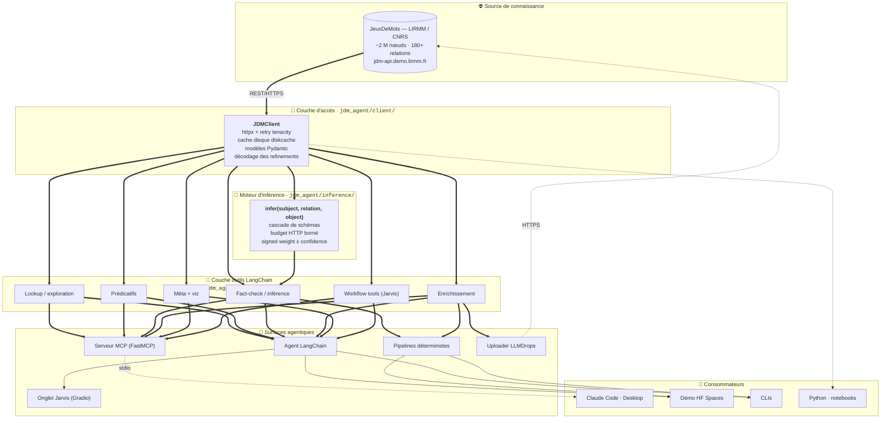

# JDMAgent

**Une couche d'agentification pour le graphe lexico-sémantique du français
JeuxDeMots : exposer une ressource symbolique construite par jeu
collaboratif à l'écosystème contemporain des agents fondés sur les
grands modèles de langue, avec un cycle d'enrichissement neuro-symbolique
soumis à un garde-fou d'inférence.**

---

## 1. Contexte

La construction et la maintenance d'une base de connaissances lexicale de
grande taille — WordNet [\[1\]](#ref-1)[\[2\]](#ref-2), ConceptNet
[\[3\]](#ref-3), BabelNet [\[4\]](#ref-4), Wikidata [\[5\]](#ref-5),
DBpedia [\[6\]](#ref-6), YAGO [\[7\]](#ref-7) — restent une entreprise
fragile : incomplétude irréductible, coût humain d'annotation, gestion de
la polysémie [\[8\]](#ref-8), dérive sémantique et incohérences locales
[\[9\]](#ref-9), évaluation fragmentée [\[10\]](#ref-10). L'approche
*Games With A Purpose* [\[11\]](#ref-11)[\[12\]](#ref-12) propose une
réponse partielle au coût d'annotation ; pour le français, **JeuxDeMots**
[\[13\]](#ref-13)[\[14\]](#ref-14)[\[15\]](#ref-15) en est l'instance la
plus aboutie (~2 M nœuds, 180+ relations typées, plus de quinze ans de
contributions).

Parallèlement, les grands modèles de langue [\[16\]](#ref-16)[\[17\]](#ref-17)
encodent une connaissance lexicale implicite — *language models as
knowledge bases* [\[18\]](#ref-18)[\[19\]](#ref-19) — mais peu auditable,
sujette à l'hallucination [\[20\]](#ref-20) et structurellement biaisée
vers l'anglais. Le couplage explicite LLM ↔ graphe reste donc nécessaire
pour les applications où la traçabilité importe [\[21\]](#ref-21).

JDMAgent comble l'écart entre JDM et l'écosystème actuel des agents (en
particulier le *tool use* [\[22\]](#ref-22)[\[23\]](#ref-23) et le
*Model Context Protocol* [\[24\]](#ref-24)) selon trois orientations :

1. **Graphe typé ≻ RAG vectoriel** [\[25\]](#ref-25) pour la connaissance
   lexicale — relations explicitement typées navigables, désambiguïsation
   par raffinements de sens.
2. **Extraction LLM séparée de la vérification déterministe** pour le
   fact-checking — on évite le motif *LLM-as-judge* [\[26\]](#ref-26) et
   ses biais [\[27\]](#ref-27)[\[28\]](#ref-28) ; chaque verdict cite
   ses sources.
3. **Inférence symbolique bornée** [\[29\]](#ref-29)[\[30\]](#ref-30)
   pour la consolidation — seul un triplet *déductible* du graphe
   existant est soumis au canal contributif de JDM.

---

## 2. Essayer sans installation

| Canal | Pour qui | Lien |
|---|---|---|
| 🌐 Démo web (Hugging Face Spaces) | Découverte interactive : explorer le graphe, fact-checker, visualiser un sous-graphe, dialoguer avec l'agent, ou exécuter les flux guidés Jarvis | [`expAg/jdmagent`](https://huggingface.co/spaces/expAg/jdmagent) |
| 🤖 Serveur MCP local | Utilisateurs de Claude Code/Desktop, Cursor, Continue | `claude mcp add jdm --scope user -- python -m jdm_agent.mcp.server` (cf. [USAGE.md](USAGE.md)) |
| 📓 Notebook Google Colab | Exploration pédagogique en Python | [](https://colab.research.google.com/github/expAg/JDMAgent/blob/main/notebooks/demo.ipynb) |

---

## 3. Architecture



### Lecture du schéma

- **Couche d'accès** : client Python typé sur l'API publique de JDM,
  cache disque, retry exponentiel, modèles Pydantic v2.
- **Moteur d'inférence** : répond à « *A R B* est-il *déductible* du
  graphe ? », distinct de la contenance (« est-il *littéralement présent* ? »).
  La distinction est conservée dans toutes les sorties.
- **Couche outils LangChain** : ~35 fonctions déclarées une fois,
  consommées indifféremment par l'agent LangChain et par le serveur MCP.
- **Pipelines déterministes** (fact-check / enrichissement) combinent
  extraction LLM et vérification symbolique. L'**uploader** poste les
  soumissions consolidées au canal contributif de JDM en préservant
  l'extension (`.enrich` / `.audit` / `.err` / `.stat`).
- **Onglet Jarvis** : cinq flux guidés par formulaire (enrichissement,
  audit, détection de trous, signalement, statistiques). Le pré-prompt
  est construit côté Python ; l'utilisateur n'écrit aucune instruction
  libre, ce qui réduit la variance des sorties.

---

## 4. Boucle d'enrichissement contributif

Un LLM tiers propose des triplets pour combler les trous de JDM, le
système les valide par inférence dans le graphe existant, et les
soumissions consolidées sont POSTées au canal contributif sans
intervention humaine.

```
┌───────────────────────────────────────────────────────────────────────┐
│ 1. Pré-fetch (list_existing_for_enrichment)                           │
│    → liste exhaustive des triplets déjà présents pour (terme, rel)    │
├───────────────────────────────────────────────────────────────────────┤
│ 2. Désambiguïsation (disambiguate, si polysémique)                    │
│    → le LLM choisit le sens visé, conserve le sense_id raffiné        │
├───────────────────────────────────────────────────────────────────────┤
│ 3. Proposition (LLM, hors exclusion_set)                              │
├───────────────────────────────────────────────────────────────────────┤
│ 4. Validation + consolidation (validate_candidate)                    │
│    → validation structurelle (unknown/duplicate/inconsistent/ok)      │
│    → consolidation par inférence (consolidated/rejected/silent)       │
│    → ready_for_submission = true ⟺ déductible du graphe existant      │
├───────────────────────────────────────────────────────────────────────┤
│ 5. Écriture + soumission (write_submission_file, upload=True)         │
│    → fichier local au format `terme | rel | cible | annot < expli >`  │
│    → upload optionnel vers http://jeuxdemots.org/LLMDrops.php         │
└───────────────────────────────────────────────────────────────────────┘
```

Discipline analogue à celle des systèmes d'auto-correction par
vérification externe recensés par [\[28\]](#ref-28).

---

## 5. Composants

| Composant | Rôle | Fichier |
|---|---|---|
| `JDMClient` | Client typé Pydantic, retry httpx, cache disque, décodage refinements | [`src/jdm_agent/client/client.py`](src/jdm_agent/client/client.py) |
| Modèles Pydantic | `Node`, `Relation`, `RelationType`, `DecodedRefinement`, `Annotation` | [`src/jdm_agent/client/models.py`](src/jdm_agent/client/models.py) |
| Cache disque | Wrapper `diskcache` à TTL configurable | [`src/jdm_agent/client/cache.py`](src/jdm_agent/client/cache.py) |
| Parser de relations | Parse `relation_definitions.md` pour enrichir les docstrings | [`src/jdm_agent/client/relations.py`](src/jdm_agent/client/relations.py) |
| Moteur d'inférence | `infer(...)` avec cascade de schémas symboliques bornée | [`src/jdm_agent/inference/`](src/jdm_agent/inference/) |
| Outils LangChain | Wrappers `@tool` ; cf. `ALL_TOOLS` | [`src/jdm_agent/tools/jdm_tools.py`](src/jdm_agent/tools/jdm_tools.py) |
| Workflow tools | `enrichment_workflow`, `audit_workflow`, `gap_detection_workflow`, `signalement_workflow`, `stats_workflow` | idem |
| Agent LangChain | `create_agent` + prompt système strict, helpers `ask()` / `stream()` | [`src/jdm_agent/tools/jdm_agent.py`](src/jdm_agent/tools/jdm_agent.py) |
| `ToolBudget` | Compteur d'appels d'outils par invocation (ContextVar), sentinel `BUDGET_EXHAUSTED` | [`src/jdm_agent/tools/budget.py`](src/jdm_agent/tools/budget.py) |
| LLM factory | `init_chat_model("provider:model")`, agnostique | [`src/jdm_agent/tools/llm_factory.py`](src/jdm_agent/tools/llm_factory.py) |
| Serveur MCP | FastMCP, réutilise les outils via `.func` | [`src/jdm_agent/mcp/server.py`](src/jdm_agent/mcp/server.py) |
| Fact-checker | `Claim`, `Verdict`, verifier déterministe + repli d'inférence | [`src/jdm_agent/factcheck/`](src/jdm_agent/factcheck/) |
| Enrichissement | `detect_gaps`, `propose_candidates`, `validate_candidate`, `consolidate_candidate` | [`src/jdm_agent/enrich/`](src/jdm_agent/enrich/) |
| Uploader LLMDrops | POST automatique, extension préservée (`.enrich` / `.audit` / `.err` / `.stat`) | [`src/jdm_agent/enrich/uploader.py`](src/jdm_agent/enrich/uploader.py) |
| Visualisation | Sous-graphe interactif vis-network (HTML autonome) | [`src/jdm_agent/viz/`](src/jdm_agent/viz/) |
| Démo Gradio | App à 6 onglets (Projet, Explorer, Claim checker, Sous-graphe, Agent, Jarvis, Aide) | [`app.py`](app.py) |
| Builders Jarvis | `build_*_prompt`, `run_jarvis_flow`, `submit_existing_file` | [`jarvis.py`](jarvis.py) |

---

## 6. Installation

Deux pistes selon ton usage :

### A. Lancer la démo Gradio (la même que sur HF Space)

C'est l'option recommandée si tu veux juste **faire tourner l'app web** sur ta machine ou un serveur (LIRMM, VPS, etc.) :

```bash
git clone https://github.com/expAg/JDMAgent.git
cd JDMAgent

python3 -m venv .venv                       # créer un venv (obligatoire sur Debian 12 — PEP 668)
source .venv/bin/activate                   # Linux/macOS — ou .venv\Scripts\activate (Windows)

pip install --upgrade pip
pip install -r requirements.txt             # même set de deps que HF Space

cp .env.example .env                        # copier le template…
# … puis éditer .env pour y mettre tes clés API (au moins celles des
# providers LLM que tu veux utiliser : ANTHROPIC_API_KEY, OPENAI_API_KEY,
# GOOGLE_API_KEY, GROQ_API_KEY, etc.) et JDM_DROPS_API_KEY pour
# soumettre automatiquement à JeuxDeMots.

python app.py                               # écoute sur http://0.0.0.0:7860
```

Ensuite, dans ton navigateur → <http://localhost:7860>.

### B. Mode dev / bibliothèque (pour brancher MCP, écrire des scripts, etc.)

Si tu veux utiliser le package `jdm_agent` programmatiquement (CLI, MCP, tests) :

```bash
git clone https://github.com/expAg/JDMAgent.git
cd JDMAgent
python3 -m venv .venv
source .venv/bin/activate                   # ou .venv\Scripts\activate sur Windows

# Installation editable + LangChain + provider(s) au choix
pip install -e ".[dev,langchain]"
pip install -e ".[anthropic]"               # Claude
pip install -e ".[openai]"                  # GPT
pip install -e ".[google]"                  # Gemini
pip install -e ".[ollama]"                  # local
pip install -e ".[mcp]"                     # serveur MCP

cp .env.example .env                        # même config que mode A
```

Tests :
```bash
pytest                  # 163/163 passants à l'heure actuelle
```

---

## 7. Démarrage rapide

```bash
# 1. Interactif : brancher le MCP dans Claude Code
claude mcp add jdm --scope user -- python -m jdm_agent.mcp.server

# 2. Batch fact-check déterministe (sans LLM)
jdm-factcheck --claim "baleine r_isa poisson"

# 3. Enrichissement + soumission automatique
jdm-enrich --terms chat --consolidate --upload --upload-model claude-opus-4-7

# 4. Python API
python -c "from jdm_agent.client import JDMClient; \
           print(JDMClient().synonyms('voiture', min_weight=50)[:3])"
```

Voir [USAGE.md](USAGE.md) pour les workflows complets et les options de
chaque CLI.

---

## 8. Roadmap par phases

| Phase | Livré | Contenu |
|---|---|---|
| 0–2 | ✅ | Bootstrap projet, client typé, couche outils LangChain |
| 3 | ✅ | Q&A CLI avec agent LangChain |
| 4 | ✅ | Serveur MCP FastMCP |
| 5 | ✅ | Fact-checker (pipeline `factcheck/`) |
| 6 | ✅ | Enrichissement actif (détection de gaps, proposition LLM, validation) |
| 7 | ⏳ | Spike DuckDB / NetworkX pour requêtes multi-saut |
| 8 | ✅ | Déploiement public — HF Spaces, Render, Colab |
| 9–10 | ✅ | Polarité, annotations, inverses verbo-nominaux |
| 11 | ✅ | Moteur d'inférence symbolique borné, consolidation des candidats |
| 12 | ✅ | Soumission automatique au LLMDrops JDM |
| 13 | ✅ | Onglet *Jarvis* — 5 flux guidés par formulaire (Enrich/Audit/Gap/Err/Stat) |

Détails et journal de bord dans [DEVELOPMENT.md](DEVELOPMENT.md).

---

## 9. Documentation complémentaire

- [USAGE.md](USAGE.md) — guide d'utilisation (CLI, MCP, Python).
- [DEVELOPMENT.md](DEVELOPMENT.md) — documentation technique et roadmap.
- [relation_definitions.md](relation_definitions.md) — taxonomie complète
  des 180+ relations JDM avec descriptions, exemples et notes
  d'orientation.

---

## 10. Références

<a id="ref-1"></a>**[1]** Miller, G. A. (1995). WordNet: A Lexical Database for English. *Communications of the ACM*, 38(11), 39–41. [DOI](https://doi.org/10.1145/219717.219748)

<a id="ref-2"></a>**[2]** Fellbaum, C. (Ed.). (1998). *WordNet: An Electronic Lexical Database*. MIT Press. [Éditeur](https://mitpress.mit.edu/9780262561167/wordnet/)

<a id="ref-3"></a>**[3]** Speer, R., Chin, J., & Havasi, C. (2017). ConceptNet 5.5: An Open Multilingual Graph of General Knowledge. *AAAI 2017*, 4444–4451. [arXiv:1612.03975](https://arxiv.org/abs/1612.03975) · [PDF](https://arxiv.org/pdf/1612.03975)

<a id="ref-4"></a>**[4]** Navigli, R., & Ponzetto, S. P. (2012). BabelNet: The automatic construction, evaluation and application of a wide-coverage multilingual semantic network. *Artificial Intelligence*, 193, 217–250. [DOI](https://doi.org/10.1016/j.artint.2012.07.001) · [PDF preprint](https://www.researchgate.net/publication/235905447)

<a id="ref-5"></a>**[5]** Vrandečić, D., & Krötzsch, M. (2014). Wikidata: a free collaborative knowledgebase. *Communications of the ACM*, 57(10), 78–85. [DOI](https://doi.org/10.1145/2629489) · [PDF](https://m-k-l.de/pubDownload/cacm2014wikidata.pdf)

<a id="ref-6"></a>**[6]** Auer, S., Bizer, C., Kobilarov, G., Lehmann, J., Cyganiak, R., & Ives, Z. (2007). DBpedia: A Nucleus for a Web of Open Data. *ISWC 2007*, LNCS 4825, 722–735. Springer. [DOI](https://doi.org/10.1007/978-3-540-76298-0_52) · [PDF](https://svn.aksw.org/papers/2007/ISWC_DBpedia/public.pdf)

<a id="ref-7"></a>**[7]** Suchanek, F. M., Kasneci, G., & Weikum, G. (2007). YAGO: A Core of Semantic Knowledge. *WWW 2007*, 697–706. [DOI](https://doi.org/10.1145/1242572.1242667) · [PDF](https://www2007.cpsc.ucalgary.ca/papers/paper391.pdf)

<a id="ref-8"></a>**[8]** Navigli, R. (2009). Word Sense Disambiguation: A Survey. *ACM Computing Surveys*, 41(2), 1–69. [DOI](https://doi.org/10.1145/1459352.1459355) · [PDF](https://www.di.uniroma1.it/~navigli/pubs/ACM_Survey_2009_Navigli.pdf)

<a id="ref-9"></a>**[9]** Paulheim, H. (2017). Knowledge graph refinement: A survey of approaches and evaluation methods. *Semantic Web*, 8(3), 489–508. [PDF](http://www.semantic-web-journal.net/system/files/swj1167.pdf)

<a id="ref-10"></a>**[10]** Pilehvar, M. T., & Camacho-Collados, J. (2019). WiC: 10,000 Example Pairs for Evaluating Context-Sensitive Meaning Representations. *NAACL-HLT 2019*, 1267–1273. [arXiv:1808.09121](https://arxiv.org/abs/1808.09121) · [PDF](https://arxiv.org/pdf/1808.09121)

<a id="ref-11"></a>**[11]** von Ahn, L. (2006). Games with a Purpose. *Computer*, 39(6), 92–94. [DOI](https://doi.org/10.1109/MC.2006.196) · [PDF](https://www.cs.cmu.edu/~biglou/ieee-gwap.pdf)

<a id="ref-12"></a>**[12]** von Ahn, L., & Dabbish, L. (2008). Designing games with a purpose. *Communications of the ACM*, 51(8), 58–67. [DOI](https://doi.org/10.1145/1378704.1378719) · [PDF](https://www.cs.cmu.edu/~biglou/Designing-Games-with-a-Purpose.pdf)

<a id="ref-13"></a>**[13]** Lafourcade, M. (2007). Making people play for Lexical Acquisition with the JeuxDeMots prototype. *SNLP 2007*, Bangkok. [PDF](https://www.lirmm.fr/~lafourca/M.L.publications/JDM-SNLP07.pdf)

<a id="ref-14"></a>**[14]** Lafourcade, M., & Joubert, A. (2008). JeuxDeMots : un prototype ludique pour l'émergence de relations entre termes. *JADT 2008*, Lyon. [PDF](https://www.lirmm.fr/~lafourca/M.L.publications/JADT2008-JDM.pdf)

<a id="ref-15"></a>**[15]** Lafourcade, M., Joubert, A., & Le Brun, N. (2015). *Games With a Purpose (GWAPs)*. Wiley-ISTE. [Éditeur](https://www.wiley.com/en-us/Games+with+a+Purpose+(GWAPs)-p-9781848217805)

<a id="ref-16"></a>**[16]** Brown, T. B., Mann, B., Ryder, N., et al. (2020). Language Models are Few-Shot Learners. *NeurIPS 2020*, 33, 1877–1901. [arXiv:2005.14165](https://arxiv.org/abs/2005.14165) · [PDF](https://arxiv.org/pdf/2005.14165)

<a id="ref-17"></a>**[17]** Touvron, H., Lavril, T., Izacard, G., et al. (2023). *LLaMA: Open and Efficient Foundation Language Models*. [arXiv:2302.13971](https://arxiv.org/abs/2302.13971) · [PDF](https://arxiv.org/pdf/2302.13971)

<a id="ref-18"></a>**[18]** Petroni, F., Rocktäschel, T., Lewis, P., Bakhtin, A., Wu, Y., Miller, A., & Riedel, S. (2019). Language Models as Knowledge Bases? *EMNLP-IJCNLP 2019*, 2463–2473. [arXiv:1909.01066](https://arxiv.org/abs/1909.01066) · [PDF](https://arxiv.org/pdf/1909.01066)

<a id="ref-19"></a>**[19]** AlKhamissi, B., Li, M., Celikyilmaz, A., Diab, M., & Ghazvininejad, M. (2022). *A Review on Language Models as Knowledge Bases*. [arXiv:2204.06031](https://arxiv.org/abs/2204.06031) · [PDF](https://arxiv.org/pdf/2204.06031)

<a id="ref-20"></a>**[20]** Ji, Z., Lee, N., Frieske, R., Yu, T., Su, D., Xu, Y., et al. (2023). Survey of Hallucination in Natural Language Generation. *ACM Computing Surveys*, 55(12), 1–38. [DOI](https://doi.org/10.1145/3571730) · [arXiv:2202.03629](https://arxiv.org/abs/2202.03629) · [PDF](https://arxiv.org/pdf/2202.03629)

<a id="ref-21"></a>**[21]** Bommasani, R., Hudson, D. A., Adeli, E., et al. (2021). *On the Opportunities and Risks of Foundation Models*. [arXiv:2108.07258](https://arxiv.org/abs/2108.07258) · [PDF](https://arxiv.org/pdf/2108.07258)

<a id="ref-22"></a>**[22]** Schick, T., Dwivedi-Yu, J., Dessì, R., Raileanu, R., Lomeli, M., Zettlemoyer, L., Cancedda, N., & Scialom, T. (2023). Toolformer: Language Models Can Teach Themselves to Use Tools. *NeurIPS 2023*. [arXiv:2302.04761](https://arxiv.org/abs/2302.04761) · [PDF](https://arxiv.org/pdf/2302.04761)

<a id="ref-23"></a>**[23]** Yao, S., Zhao, J., Yu, D., Du, N., Shafran, I., Narasimhan, K., & Cao, Y. (2023). ReAct: Synergizing Reasoning and Acting in Language Models. *ICLR 2023*. [arXiv:2210.03629](https://arxiv.org/abs/2210.03629) · [PDF](https://arxiv.org/pdf/2210.03629)

<a id="ref-24"></a>**[24]** Anthropic. (2024). *Introducing the Model Context Protocol*. [Site officiel](https://www.anthropic.com/news/model-context-protocol) · [Spec](https://modelcontextprotocol.io)

<a id="ref-25"></a>**[25]** Lewis, P., Perez, E., Piktus, A., et al. (2020). Retrieval-Augmented Generation for Knowledge-Intensive NLP Tasks. *NeurIPS 2020*, 33, 9459–9474. [arXiv:2005.11401](https://arxiv.org/abs/2005.11401) · [PDF](https://arxiv.org/pdf/2005.11401)

<a id="ref-26"></a>**[26]** Zheng, L., Chiang, W.-L., Sheng, Y., et al. (2023). Judging LLM-as-a-Judge with MT-Bench and Chatbot Arena. *NeurIPS 2023*. [arXiv:2306.05685](https://arxiv.org/abs/2306.05685) · [PDF](https://arxiv.org/pdf/2306.05685)

<a id="ref-27"></a>**[27]** Min, S., Krishna, K., Lyu, X., Lewis, M., Yih, W., Koh, P. W., Iyyer, M., Zettlemoyer, L., & Hajishirzi, H. (2023). FActScore: Fine-grained Atomic Evaluation of Factual Precision in Long Form Text Generation. *EMNLP 2023*, 12076–12100. [arXiv:2305.14251](https://arxiv.org/abs/2305.14251) · [PDF](https://arxiv.org/pdf/2305.14251)

<a id="ref-28"></a>**[28]** Pan, L., Saxon, M., Xu, W., Nathani, D., Wang, X., & Wang, W. Y. (2024). Automatically Correcting Large Language Models: Surveying the Landscape of Diverse Self-Correction Strategies. *TACL*, 12, 484–506. [arXiv:2308.03188](https://arxiv.org/abs/2308.03188) · [PDF](https://arxiv.org/pdf/2308.03188)

<a id="ref-29"></a>**[29]** Garcez, A. d'A., & Lamb, L. C. (2023). Neurosymbolic AI: the 3rd Wave. *Artificial Intelligence Review*, 56, 12387–12406. [DOI](https://doi.org/10.1007/s10462-023-10448-w) · [arXiv:2012.05876](https://arxiv.org/abs/2012.05876) · [PDF](https://arxiv.org/pdf/2012.05876)

<a id="ref-30"></a>**[30]** Hitzler, P., Eberhart, A., Ebrahimi, M., Sarker, M. K., & Zhou, L. (2022). Neuro-symbolic approaches in artificial intelligence. *National Science Review*, 9(6), nwac035. [DOI](https://doi.org/10.1093/nsr/nwac035) · [PDF](https://academic.oup.com/nsr/article-pdf/9/6/nwac035/44170120/nwac035.pdf)

---

## Crédits

- **JeuxDeMots** : M. Lafourcade et l'équipe TEXTE, **LIRMM, CNRS /
  Université de Montpellier**. Plateforme lancée en 2007, alimentée par
  un grand nombre de contributeurs via les jeux *Diko*, *TOTAKI*, *AskIt*, etc.
  - Site jeu : <https://www.jeuxdemots.org>
  - API publique : <https://jdm-api.demo.lirmm.fr>
  - Documentation des relations : <https://www.jeuxdemots.org/jdm-about-detail-relations.php>
- **LangChain** : <https://langchain.com>
- **Model Context Protocol** : <https://modelcontextprotocol.io>
- **FastMCP** : <https://github.com/jlowin/fastmcp>

## Licence

À définir.
