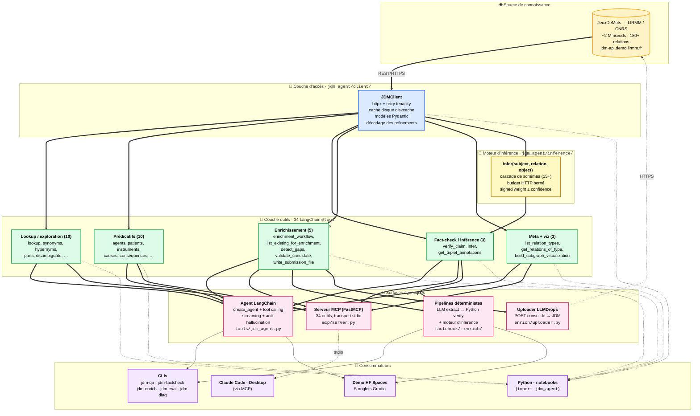

# JDMAgent

**Agentification d'un graphe lexico-sémantique du français pour les modèles de langue modernes.**

JDMAgent transforme **[JeuxDeMots](https://www.jeuxdemots.org)** — une base de
connaissances lexicale du français comptant environ 2 millions de nœuds et plus
de 180 relations typées, construite en dix-huit ans de jeu collaboratif sous la
direction de M. Lafourcade au LIRMM / CNRS — en une **ressource agentique**
directement exploitable par les LLM modernes (Claude, GPT, modèles locaux via
Ollama), à travers une couche d'outils Python standardisés et un serveur
[Model Context Protocol (MCP)](https://modelcontextprotocol.io).

Le projet adresse trois usages prioritaires (Q&A *grounded*, fact-checking
anti-hallucination, enrichissement assisté de la base) et fournit en couche
basse un client typé, un cache disque, et un moteur d'inférence symbolique
borné.

---

## Essayer sans installation

| Canal | Pour qui | Lien |
|---|---|---|
| 🌐 **Démo web** (Hugging Face Spaces) | Découverte interactive — explorer le graphe, fact-checker, visualiser un sous-graphe, dialoguer avec l'agent (BYOK) | [`expAg/jdmagent`](https://huggingface.co/spaces/expAg/jdmagent) |
| 🤖 **Serveur MCP local** | Utilisateurs de Claude Code/Desktop, Cursor, Continue | `claude mcp add jdm --scope user -- python -m jdm_agent.mcp.server` (cf. [USAGE.md](USAGE.md)) |
| 📓 **Notebook Google Colab** | Exploration pédagogique en Python | [](https://colab.research.google.com/github/expAg/JDMAgent/blob/main/notebooks/demo.ipynb) |

---

## Motivation scientifique

Trois positions méthodologiques structurent le projet et le distinguent des
approches purement vectorielles ou purement génératives.

### 1. Graphe typé ≻ RAG vectoriel pour la connaissance lexicale

Le RAG vectoriel approxime la similarité sémantique par distance d'embeddings,
mais **perd la structure relationnelle**. JeuxDeMots expose au contraire des
relations *explicitement typées* (`r_isa` hyperonymie, `r_has_part` méronymie,
`r_telic_role` finalité, `r_agent` sujet du procès, etc. —
[180+ types documentés](relation_definitions.md)), navigables transitivement.

Pour la classe de questions « qu'est-ce qu'un X ? », « Y est-il un type de
Z ? », « à quoi sert un W ? », la structure typée est strictement plus
expressive qu'une similarité d'embeddings : on peut chaîner les relations,
détecter des incompatibilités via `r_isa-incompatible`, désambiguïser la
polysémie via des raffinements de sens (`avocat>116477>66699`).

### 2. Hybride neuro-symbolique séparé pour le fact-checking

Le pipeline de vérification ([`factcheck/`](src/jdm_agent/factcheck/)) sépare
strictement deux phases :

| Phase | Implémentée par | Justification |
|---|---|---|
| **Extraction** (NL → triplet) | LLM | Tâche linguistique où la créativité du LLM est requise |
| **Vérification** (triplet → verdict) | Python pur + JDM | Tâche logique, exige déterminisme et traçabilité |

La vérification ne fait *jamais* appel au LLM. Elle est auditable (chaque
verdict cite ses triplets sources), reproductible, et résistante aux biais
de génération. C'est l'inverse du pattern *LLM-as-judge* qui peut halluciner
ses propres verdicts.

### 3. Moteur d'inférence symbolique borné (Phase 11)

Au-delà de la simple recherche en *contenance* (« JDM contient-il A R B ? »),
le moteur d'inférence ([`inference/`](src/jdm_agent/inference/)) répond à la
question distincte « A R B est-il *déductible* du graphe ? ». Il enchaîne
une cascade de schémas symboliques (inversion, implication, transitivité,
déduction par généralisation, élimination par classe, propagation par
hyponymie, contraste antonymique, cohyponymie, géo-propagation, composition,
etc.), bornée par un budget dur d'appels HTTP.

**Distinction conservée** entre les deux régimes : un résultat inféré porte
toujours `inference_schema` et son explication précise *« JDM ne contient pas
directement ce triplet, mais on peut le déduire : … »*. La contenance et
l'inférence ne sont jamais confondues — discipline essentielle pour préserver
la confiance dans la ressource.

Cette même mécanique sert à **consolider** les candidats proposés par un LLM
en phase d'enrichissement : seul un triplet *déductible* du réseau JDM
existant est jugé prêt pour soumission, ce qui ferme la boucle entre
proposition créative (LLM) et garantie logique (graphe).

### 4. Tool calling + MCP : la pile standardisée des agents augmentés

Un agent LLM au sens moderne = LLM + outils + boucle de décision + prompt
système. Le LLM ne décide pas de la sémantique des outils : il choisit lequel
appeler en lisant leur description et leur schéma de paramètres. C'est cette
autonomie de routage qui distingue un agent d'un RAG fixe.

Le **Model Context Protocol**, normalisé par Anthropic fin 2024, est devenu
en quelques mois le standard de facto pour brancher des outils à n'importe
quel agent LLM. Notre serveur MCP ([`mcp/server.py`](src/jdm_agent/mcp/server.py))
expose les **34 outils JDM** en une seule commande d'installation, sans
duplication de code par rapport à l'agent LangChain — les deux surfaces
partagent la même implémentation Python.

---

## Architecture



### Lecture du schéma

Six couches, du concret vers l'interactif :

1. **Source** — l'API REST publique de JeuxDeMots, lecture seule. Les
   contributions sortantes (cf. couche *Uploader*) passent par un canal
   dédié séparé (LLMDrops, Phase 12).
2. **Accès** — un client Python typé avec cache disque agressif. Les coûts
   HTTP sont quasi nuls après le premier appel grâce à
   [`diskcache`](src/jdm_agent/client/cache.py).
3. **Inférence** — un moteur autonome qui implémente la cascade de schémas
   symboliques. Réutilisé par `verify_claim` (effort ≥ 1), `infer` et la
   consolidation des candidats d'enrichissement.
4. **Outils** — 34 fonctions Python décorées `@tool`, dont les docstrings
   sont *enrichies automatiquement* à partir de
   [`relation_definitions.md`](relation_definitions.md) pour guider le
   routage du LLM.
5. **Agents** — quatre portes d'entrée pour les LLM et les clients :
   - **Agent LangChain** : pilote un LLM externe avec prompt système
     anti-hallucination ;
   - **Serveur MCP** : expose les mêmes outils à n'importe quel client
     compatible (Claude Code/Desktop, Cursor, Continue) ;
   - **Pipelines déterministes** : factcheck et enrichissement, combinant
     extraction LLM et vérification symbolique ;
   - **Uploader LLMDrops** : POST automatique d'une soumission consolidée
     au endpoint contributif de JDM.
6. **Consommateurs** — usage final : conversation dans Claude Code/Desktop,
   démo web (HF Spaces), CLIs batch, scripts Python.

### Cycle d'une question — « que peut faire un chat ? »

```
1. L'utilisateur pose la question dans Claude Code.
2. Le LLM lit la question + les 34 outils sérialisés en JSON Schema.
3. Il route mentalement : « action que peut faire un sujet » → r_agent-1
   « source = nom commun, donc pas get_agents (qui exige un verbe) »
   « r_agent-1 → inverse verbo-nominal → get_actions_of »
4. Il génère un tool_use structuré : get_actions_of(term="chat")
5. La couche outils interroge JDM, décode les refinements éventuels,
   renvoie une liste de triplets {source, relation, target, w, polarity, …}.
6. Le LLM compose une réponse NL en citant les triplets de plus haut poids.
```

La boucle peut s'enchaîner sur 3 à 10 outils pour une question complexe
(par exemple `disambiguate` → `get_synonyms` → `verify_claim` × 5). Le LLM
gère le routage à chaque tour en fonction des résultats précédents.

---

## Composants principaux

| Composant | Rôle | Fichier |
|---|---|---|
| **JDMClient** | Client typé Pydantic, retry httpx, cache disque, décodage refinements | [`src/jdm_agent/client/client.py`](src/jdm_agent/client/client.py) |
| **Modèles Pydantic** | `Node`, `Relation`, `RelationType`, `DecodedRefinement`, `Annotation` | [`src/jdm_agent/client/models.py`](src/jdm_agent/client/models.py) |
| **Cache disque** | Wrapper `diskcache` à TTL configurable par catégorie | [`src/jdm_agent/client/cache.py`](src/jdm_agent/client/cache.py) |
| **Parser de relations** | Parse `relation_definitions.md` pour enrichir les docstrings | [`src/jdm_agent/client/relations.py`](src/jdm_agent/client/relations.py) |
| **Moteur d'inférence** | `infer(...)` avec cascade de schémas symboliques bornée | [`src/jdm_agent/inference/`](src/jdm_agent/inference/) |
| **34 outils LangChain** | Wrappers `@tool` (10 exploration + 10 prédicatifs + 3 fact-check + 5 enrichissement + 3 méta/viz + 3 inverses verbo-nominaux ; cf. `ALL_TOOLS`) | [`src/jdm_agent/tools/jdm_tools.py`](src/jdm_agent/tools/jdm_tools.py) |
| **Agent LangChain** | `create_agent` + prompt système strict, helpers `ask()` / `stream()` | [`src/jdm_agent/tools/jdm_agent.py`](src/jdm_agent/tools/jdm_agent.py) |
| **LLM factory** | `init_chat_model("provider:model")`, agnostique | [`src/jdm_agent/tools/llm_factory.py`](src/jdm_agent/tools/llm_factory.py) |
| **Serveur MCP** | FastMCP, réutilise les 34 outils via `.func` | [`src/jdm_agent/mcp/server.py`](src/jdm_agent/mcp/server.py) |
| **Fact-checker** | `Claim`, `Verdict`, verifier déterministe + repli d'inférence | [`src/jdm_agent/factcheck/`](src/jdm_agent/factcheck/) |
| **Enrichissement** | `detect_gaps`, `propose_candidates`, `validate_candidate`, `consolidate_candidate`, `enrichment_workflow` | [`src/jdm_agent/enrich/`](src/jdm_agent/enrich/) |
| **Uploader LLMDrops** | POST automatique d'une soumission consolidée à JDM | [`src/jdm_agent/enrich/uploader.py`](src/jdm_agent/enrich/uploader.py) |
| **Visualisation** | Sous-graphe interactif vis-network (HTML autonome) | [`src/jdm_agent/viz/`](src/jdm_agent/viz/) |
| **Taxonomie des relations** | 180+ relations JDM avec descriptions et exemples | [`relation_definitions.md`](relation_definitions.md) |
| **CLIs** | 6 entry points (`qa`, `eval`, `mcp`, `diag`, `factcheck`, `enrich`) | [`src/jdm_agent/apps/`](src/jdm_agent/apps/) |
| **Démo HF** | App Gradio à 5 onglets | [`app.py`](app.py) |

---

## Boucle d'enrichissement de bout en bout (Phase 11–12)

C'est la **finalité visée** par le projet : un LLM tiers propose des triplets
pour boucher les trous de JDM, le système les valide par inférence dans le
graphe, et les soumissions consolidées sont POSTées au endpoint contributif
de JDM sans intervention humaine.

```
┌───────────────────────────────────────────────────────────────────────┐
│ 1. Pré-fetch (list_existing_for_enrichment)                           │
│    → liste exhaustive des triplets déjà présents pour (term, rel)     │
│    → exclusion_set normalisé prêt pour matching                       │
├───────────────────────────────────────────────────────────────────────┤
│ 2. Désambiguïsation (disambiguate, si polysémique)                    │
│    → le LLM choisit le sens visé, conserve le sense_id raffiné        │
├───────────────────────────────────────────────────────────────────────┤
│ 3. Proposition (LLM, hors exclusion_set)                              │
│    → la correction sémantique est la responsabilité du LLM            │
├───────────────────────────────────────────────────────────────────────┤
│ 4. Validation + consolidation (validate_candidate)                    │
│    → validation structurelle (unknown/duplicate/inconsistent/ok)      │
│    → consolidation par inférence (consolidated/rejected/silent)       │
│    → ready_for_submission = true ⟺ déductible du graphe existant      │
├───────────────────────────────────────────────────────────────────────┤
│ 5. Écriture + soumission (write_submission_file, upload=True)         │
│    → fichier local au format `terme | rel | cible | annot < expli >`  │
│    → upload optionnel vers http://jeuxdemots.org/LLMDrops.php         │
│    → nom standardisé HHhMM_DD-MM-YY_automatic_submission_from_X.enrich│
└───────────────────────────────────────────────────────────────────────┘
```

La consolidation par inférence est ce qui distingue ce projet d'une simple
*proposition* à base de LLM : on ne soumet à JDM que des triplets que le
graphe existant *permet déjà de déduire*, garantissant cohérence et qualité.

---

## Installation

```bash
git clone https://github.com/expAg/JDMAgent.git
cd JDMAgent
python -m venv .venv
.venv\Scripts\activate          # Windows  (ou source .venv/bin/activate)

# Installation de base + LangChain
pip install -e ".[dev,langchain]"

# Providers LLM (au choix)
pip install -e ".[anthropic]"   # Claude
pip install -e ".[openai]"      # GPT
pip install -e ".[ollama]"      # local

# Serveur MCP (recommandé)
pip install -e ".[mcp]"

# Configuration
cp .env.example .env
# édite .env : ANTHROPIC_API_KEY / OPENAI_API_KEY / LLM_PROVIDER / LLM_MODEL
# et pour la soumission Phase 12 : JDM_DROPS_API_KEY
```

Tests :
```bash
pytest                  # 89/89 passants
```

---

## Démarrage rapide

```bash
# 1. Interactif : brancher le MCP dans Claude Code
claude mcp add jdm --scope user -- python -m jdm_agent.mcp.server

# 2. Batch fact-check déterministe (sans LLM)
jdm-factcheck --claim "baleine r_isa poisson"

# 3. Enrichissement + soumission automatique
jdm-enrich --terms chat --consolidate --upload --upload-model claude-opus-4-7

# 4. Python API
python -c "from jdm_agent.client import JDMClient; \
           print(JDMClient().synonyms('voiture', min_weight=50)[:3])"
```

Voir [USAGE.md](USAGE.md) pour les workflows complets et les options de
chaque CLI.

---

## Roadmap par phases

| Phase | Livré | Contenu |
|---|---|---|
| 0–2 | ✅ | Bootstrap projet, client typé, couche outils LangChain |
| 3 | ✅ | Q&A CLI avec agent LangChain |
| 4 | ✅ | Serveur MCP FastMCP |
| 5 | ✅ | Fact-checker (pipeline `factcheck/`) |
| 6 | ✅ | Enrichissement actif (détection de gaps, proposition LLM, validation) |
| 7 | ⏳ | Spike DuckDB / NetworkX pour requêtes multi-saut |
| 8 | ✅ | Déploiement public — HF Spaces, Render, Colab |
| 9–10 | ✅ | Polarité, annotations, inverses verbo-nominaux |
| 11 | ✅ | Moteur d'inférence symbolique borné, consolidation des candidats |
| 12 | ✅ | Soumission automatique au LLMDrops JDM |

Détails et journal de bord dans [DEVELOPMENT.md](DEVELOPMENT.md).

---

## Statut

- **89/89 tests** passants (pytest + respx pour les mocks HTTP).
- **34 outils MCP**, exposés indifféremment à l'agent LangChain et à tout
  client MCP.
- **6 CLIs** : `jdm-qa`, `jdm-eval`, `jdm-mcp`, `jdm-diag`, `jdm-factcheck`,
  `jdm-enrich`.
- **Démo HF Spaces** publique à 5 onglets : Projet, Explorer JDM, Claim
  checker, Sous-graphe, Agent (BYOK).

---

## Documentation

- **[USAGE.md](USAGE.md)** — guide d'utilisation complet. Trois canaux
  (Claude Code via MCP, CLI, Python API), workflows-types, lecture des
  sorties (terminal, JSON, CSV, fichier de soumission).
- **[DEVELOPMENT.md](DEVELOPMENT.md)** — documentation technique. Roadmap
  détaillée, setup dev, tests, dépannage, considérations de performance,
  contributions.
- **[relation_definitions.md](relation_definitions.md)** — taxonomie
  complète des 180+ relations JDM avec descriptions, exemples, et notes
  sur l'orientation tête/queue. Utilisée pour enrichir automatiquement
  les docstrings des outils LangChain.

---

## Crédits et références

### JeuxDeMots

Mathieu Lafourcade et l'équipe TEXTE, **LIRMM, CNRS / Université de
Montpellier**. Plateforme lancée en 2007, alimentée par des centaines de
milliers de contributeurs via les jeux *Diko*, *TOTAKI*, *AskIt*, etc.

- Site jeu : <https://www.jeuxdemots.org>
- API publique : <https://jdm-api.demo.lirmm.fr>
- Documentation des relations : <https://www.jeuxdemots.org/jdm-about-detail-relations.php>

### Frameworks et protocoles

- **LangChain** ([langchain.com](https://langchain.com)) — agentification,
  tool calling, structured output.
- **Model Context Protocol** ([modelcontextprotocol.io](https://modelcontextprotocol.io))
  — protocole ouvert d'outils LLM, spécifié par Anthropic.
- **FastMCP** — implémentation Python de référence côté serveur MCP.
- **Pydantic v2, httpx, tenacity, diskcache, respx** — fondations Python.

### Cadre scientifique

Le projet s'inscrit dans la lignée des travaux sur :

- les **agents LLM tool-augmentés** (Toolformer, ReAct, OpenAI function
  calling, Anthropic tool use, MCP) ;
- la **knowledge-graph augmented generation** (KAG), par opposition au
  RAG vectoriel ;
- les **architectures neuro-symboliques** mêlant raisonnement déterministe
  borné et génération neuronale ;
- les **bases de connaissances lexicales construites par jeu** (WordNet,
  ConceptNet, et JeuxDeMots pour le français).

---

## Licence

À définir.
